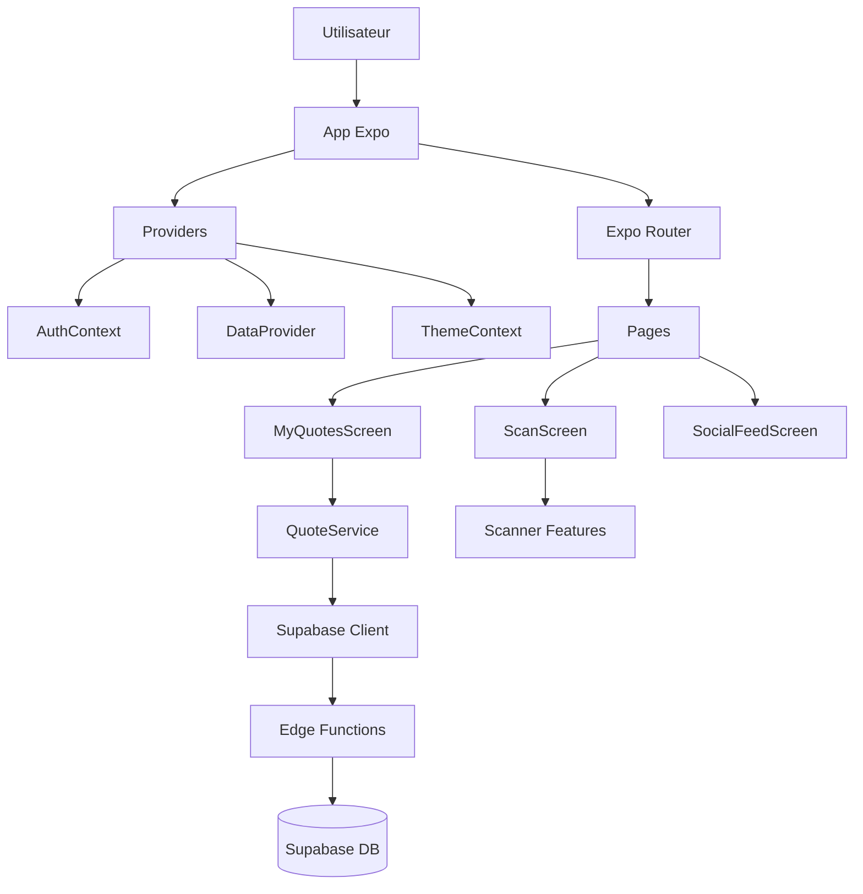
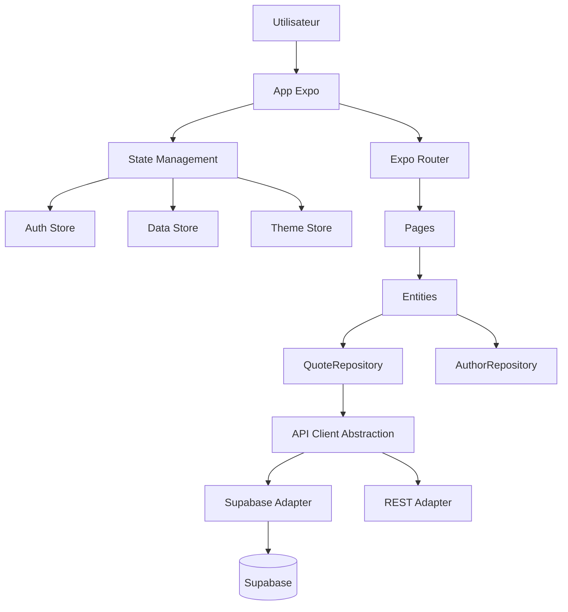

# 📚 QUOTEX - Analyse Complète & Prompt pour Audit Technique

> **Date** : 30 mai 2026  
> **Version** : 1.0  
> **Auteur** : Analyse automatique via Mistral Vibe  
> **Objectif** : Documentation pour préparation d'un audit technique complet

---

## 📌 TABLE DES MATIÈRES

1. [Description Fonctionnelle de Quotex](#-description-fonctionnelle-de-quotex)
2. [Arborescence du Code](#-arborescence-du-code)
3. [Points Clés pour un Audit](#-points-clés-pour-un-audit)
4. [Prompt pour Audit Technique](#-prompt-pour-audit-technique)
5. [Points Forts et Points à Surveiller](#-points-forts-et-points-à-surveiller)

---

## 🎯 DESCRIPTION FONCTIONNELLE DE QUOTEX

**Quotex est une application mobile (iOS/Android) de gestion de citations littéraires**, construite avec **Expo/React Native** et un backend **Supabase**.

### 📱 Plateformes Cibles
- **iOS** : Supported (via Expo)
- **Android** : Supported (via Expo)
- **Web** : Potentiellement (configuration Expo Web présente)

### ✨ Fonctionnalités Principales

| Catégorie | Fonctionnalités | Statut |
|-----------|------------------|--------|
| **📚 Gestion de Citations** | Ajout, modification, suppression, sauvegarde, like, partage de citations | ✅ Implémenté |
| **🔍 Scan Intelligent** | OCR en temps réel via caméra (ML Kit), scan d'ISBN, import de texte depuis des images | ✅ Implémenté |
| **📖 Gestion de Livres** | Recherche, détails enrichis (couverture, descriptions, liens d'achat), statut de lecture | ✅ Implémenté |
| **✍️ Gestion d'Auteurs** | Profils d'auteurs, œuvres similaires, suivi, enrichissement automatique | ✅ Implémenté |
| **🔎 Recherche Avancée** | Recherche de livres, auteurs, citations, avec suggestions | ✅ Implémenté |
| **👥 Réseau Social** | Feed social, profils utilisateurs, suivi d'auteurs/livres | ✅ Implémenté |
| **🎨 Personnalisation** | Thèmes (clair/sombre), organisation des blocs de contenu par glisser-déposer | ✅ Implémenté |
| **☁️ Synchronisation** | Mode hors ligne avec cache local + sync automatique avec Supabase | ✅ Implémenté |
| **🔒 Authentification** | Google Sign-In, gestion de sessions persistantes | ✅ Implémenté |
| **🤖 Intelligence Artificielle** | Interprétation automatique des citations, enrichissement des données | ✅ Implémenté |

### 🎨 Expérience Utilisateur
- **3 onglets principaux** : Mes Citations / Scanner / Feed Social
- **Navigation fluide** : Expo Router avec animations
- **Design moderne** : Thème clair/sombre, animations Reanimated
- **Accessibilité** : Icons Lucide, tailles adaptatives

---

## 🗂️ ARBORESCENCE DU CODE

```bash
quotex/
├── app/                          # 📱 Routes Expo Router (Frontend)
│   ├── (app)/                    # Zone authentifiée (requiert connexion)
│   │   ├── _layout.tsx           # Layout principal de l'application
│   │   ├── index.tsx             # Container des 3 onglets principaux (MyQuotes, Scan, Social)
│   │   ├── quote-detail.tsx      # Écran de détail d'une citation
│   │   ├── book-detail.tsx       # Écran de détail d'un livre
│   │   ├── author-detail.tsx     # Écran de détail d'un auteur
│   │   ├── theme-detail.tsx      # Écran de détail d'un thème
│   │   ├── prize-detail.tsx      # Écran de détail d'un prix littéraire
│   │   ├── scan.tsx              # Écran de scan de citations
│   │   ├── search.tsx            # Écran de recherche
│   │   ├── settings.tsx          # Écran des paramètres
│   │   └── user-profile.tsx      # Écran de profil utilisateur
│   │
│   ├── (auth)/                   # Zone d'authentification
│   │   ├── _layout.tsx           # Layout pour les écrans d'auth
│   │   ├── login.tsx             # Écran de connexion
│   │   ├── login-password.tsx    # Connexion avec mot de passe
│   │   ├── register.tsx          # Écran d'inscription
│   │   └── register-details.tsx  # Complétion du profil après inscription
│   │
│   ├── _layout.tsx               # Root Layout avec tous les providers
│   └── index.tsx                 # Point d'entrée - redirige vers (app)
│
├── src/                          # 🏗️ Logique Métier et Composants
│   │
│   ├── app/
│   │   └── providers/            # 🔧 Contextes React (État global)
│   │       ├── AuthContext.tsx   # Gestion de l'authentification (utilisateur, connexion/déconnexion)
│   │       ├── DataProvider.tsx  # ⭐ CŒUR DE L'APPLICATION : Gestion centralisée des données
│   │       │                      # (citations, auteurs, livres, synchronisation)
│   │       ├── TabContext.tsx    # Gestion de l'état des onglets et du swipe
│   │       └── ThemeContext.tsx  # Gestion du thème (clair/sombre) et des couleurs
│   │
│   ├── entities/                 # 📦 Architecture par Entités (Domain-Driven Design)
│   │   │
│   │   ├── author/               # Tout ce qui concerne les AUTEURS
│   │   │   ├── api/
│   │   │   │   ├── AuthorService.ts      # Services API pour les auteurs
│   │   │   │   └── WikidataService.ts     # Intégration avec Wikidata pour l'enrichissement
│   │   │   └── ui/
│   │   │       ├── AuthorCardItem.tsx     # Carte d'auteur (composant réutilisable)
│   │   │       └── AuthorDetail.tsx       # Composant de détail d'auteur
│   │   │
│   │   ├── book/                 # Tout ce qui concerne les LIVRES
│   │   │   ├── api/
│   │   │   │   └── BookSearchService.ts   # Recherche de livres
│   │   │   ├── lib/
│   │   │   │   ├── bookImport.ts          # Logique d'import de livres
│   │   │   │   └── loadBookDetailData.ts  # Chargement des données détaillées
│   │   │   └── ui/
│   │   │       ├── BookCardItem.tsx       # Carte de livre
│   │   │       ├── BookDetail.tsx         # Composant de détail
│   │   │       ├── BookDetail.styles.ts   # Styles dédiés
│   │   │       ├── BookDetailScreen.tsx   # Écran complet
│   │   │       ├── BookDetailSkeleton.tsx # Skeleton de chargement
│   │   │       ├── ReviewBlock.tsx        # Bloc d'avis
│   │   │       └── useBookDetailController.ts # Logique du contrôleur
│   │   │
│   │   ├── quote/                # Tout ce qui concerne les CITATIONS
│   │   │   ├── api/
│   │   │   │   ├── QuoteService.ts       # ⭐ Services API pour les citations
│   │   │   │   └── __tests__/
│   │   │   │       └── QuoteService.test.ts # Tests unitaires
│   │   │   └── ui/
│   │   │       ├── AIChatModal.tsx        # Modal de chat IA
│   │   │       ├── AddQuoteMenu.tsx       # Menu d'ajout de citation
│   │   │       ├── EnrichingSkeleton.tsx  # Skeleton pendant l'enrichissement
│   │   │       ├── FilterModal.tsx        # Modal de filtrage
│   │   │       ├── QuoteActionModal.tsx   # Modal d'actions sur une citation
│   │   │       ├── QuoteCard.tsx          # Carte de citation
│   │   │       └── QuoteDetailModal.tsx   # Modal de détail
│   │   │
│   │   ├── theme/                # Gestion des THÈMES littéraires
│   │   │   └── ui/
│   │   │       ├── ThemeCardItem.tsx     # Carte de thème
│   │   │       └── ThemeDetail.tsx       # Détail d'un thème
│   │   │
│   │   └── user/                 # Gestion des UTILISATEURS
│   │       ├── api/
│   │       │   └── AuthService.ts         # Services d'authentification
│   │       └── ui/
│   │           └── UserProfile.tsx         # Composant de profil utilisateur
│   │
│   ├── features/                 # ✨ Fonctionnalités Transverses
│   │   │
│   │   ├── dictionary/           # Dictionnaire et définitions
│   │   │   ├── api/
│   │   │   │   └── WiktionaryService.ts   # Intégration avec Wiktionary
│   │   │   └── ui/
│   │   │       ├── BookDictionaryModal.tsx  # Modal de dictionnaire pour un livre
│   │   │       └── WordSelectionModal.tsx   # Modal de sélection de mots
│   │   │
│   │   ├── edit-book/            # Édition de livres
│   │   │   └── ui/
│   │   │       └── AddBlockModal.tsx      # Modal d'ajout de blocs
│   │   │
│   │   ├── scanner/              # 📷 SCAN DE CITATIONS (Fonctionnalité phare)
│   │   │   ├── model/
│   │   │   │   ├── mlKitParser.ts        # Parseur des résultats ML Kit (OCR)
│   │   │   │   ├── textReconstructor.ts  # Reconstruction intelligente du texte
│   │   │   │   ├── useIsbnScanner.ts      # Hook pour le scan d'ISBN
│   │   │   │   ├── useLiveOCR.ts          # Hook pour l'OCR en temps réel
│   │   │   │   └── useScanWorkflow.ts     # Logique du workflow de scan
│   │   │   └── ui/
│   │   │       ├── AnimatedISBNPopup.tsx   # Popup animée pour les résultats ISBN
│   │   │       ├── BarcodeScannerModal.tsx # Modal de scan de code-barres
│   │   │       ├── ScanFrameOverlay.tsx    # Overlay du cadre de scan
│   │   │       ├── ScanPreviewModal.tsx    # Modal de prévisualisation
│   │   │       └── ScanWorkflow.tsx        # Composant principal du workflow
│   │   │
│   │   └── search/               # Recherche
│   │       └── api/
│   │           └── SearchService.ts       # Services de recherche
│   │
│   ├── pages/                    # 📄 Pages Principales (Composants Conteneurs)
│   │   ├── MyQuotesScreen.tsx    # Écran des citations de l'utilisateur
│   │   ├── PrizeDetailScreen.tsx # Écran de détail d'un prix
│   │   ├── ScanScreen.tsx        # Écran principal de scan
│   │   ├── SearchScreen.tsx      # Écran principal de recherche
│   │   └── SocialFeedScreen.tsx  # Écran du feed social
│   │
│   └── shared/                   # 🔧 Code Partagé (Utilitaires)
│       │
│       ├── api/                  # Services API partagés
│       │   ├── BlockService.ts   # Gestion des blocs de contenu
│       │   ├── PrizeService.ts   # Gestion des prix littéraires
│       │   ├── ReviewService.ts  # Gestion des avis
│       │   ├── StorageService.ts # ⭐ Gestion du cache local (AsyncStorage)
│       │   ├── staticData.ts     # Données statiques initiales (citations, livres, auteurs)
│       │   ├── supabase.ts       # ⭐ Client Supabase (configuration centrale)
│       │   └── types.ts          # ⭐ Types TypeScript partagés
│       │
│       ├── config/               # Configuration de l'application
│       │   ├── api.ts            # Configuration des URLs API (local/dev/prod)
│       │   ├── blocks.ts         # Configuration des types de blocs
│       │   └── stores.ts          # Configuration des stores
│       │
│       ├── lib/                  # Bibliothèques utilitaires
│       │   ├── __tests__/
│       │   │   ├── dataHelpers.test.ts  # Tests pour dataHelpers
│       │   │   └── dateUtils.test.ts    # Tests pour dateUtils
│       │   ├── dataHelpers.ts    # Helpers de manipulation de données
│       │   ├── dateUtils.ts      # Utilitaires de dates
│       │   ├── scanGeometry.ts   # Calculs géométriques pour le scan
│       │   └── hooks/
│       │       ├── useNetworkSync.ts   # ⭐ Hook de synchronisation réseau/hors ligne
│       │       └── useSmartNavigation.ts # Hook de navigation intelligente
│       │
│       └── theme/                # Thématisation
│           ├── colors.ts         # Palette de couleurs
│           └── index.ts          # Thème principal
│       │
│       └── ui/                   # Composants UI partagés
│           ├── AnimatedSplashScreen.tsx  # Écran de splash animé
│           ├── PageIndicator.tsx         # Indicateur de page
│           ├── QuotexLogo.tsx            # Logo de l'application
│           ├── SyncStatusIndicator.tsx   # Indicateur de statut de synchronisation
│           ├── TypingText.tsx            # Texte avec effet de frappe
│           └── blocks/                   # 🧩 SYSTÈME DE BLOCS MODULAIRES
│               ├── BlockDispatcher.tsx   # Dispatcher des blocs
│               ├── BlockWrapper.tsx      # Wrapper générique
│               ├── AuthorBlock.tsx        # Bloc auteur
│               ├── BookInfoBlock.tsx      # Bloc d'informations livre
│               ├── BuyLinkBlock.tsx      # Bloc de liens d'achat
│               ├── ConnectionBlock.tsx    # Bloc de connexion
│               ├── DefinitionBlock.tsx    # Bloc de définitions
│               ├── EditionsBlock.tsx      # Bloc d'éditions
│               ├── NotesBlock.tsx         # Bloc de notes
│               ├── SavedQuotesBlock.tsx   # Bloc de citations sauvegardées
│               ├── SimilarAuthorsBlock.tsx # Bloc d'auteurs similaires
│               └── SimilarBooksBlock.tsx  # Bloc de livres similaires
│
├── server/                       # 🖥️ Backend Local (pour tests/développement)
│   └── test/
│
├── supabase/                     # ☁️ Backend Supabase
│   ├── config.toml               # Configuration du projet Supabase
│   └── functions/                # ⭐ Edge Functions (API Serverless)
│       ├── check-email/
│       │   └── index.ts          # Vérification des emails
│       ├── quotes/
│       │   └── index.ts          # Gestion des citations
│       ├── authors/
│       │   └── index.ts          # Gestion des auteurs
│       ├── books/
│       │   └── index.ts          # Gestion des livres
│       ├── auth/
│       │   └── index.ts          # Authentification
│       ├── sync-prizes/
│       │   └── index.ts          # Synchronisation des prix
│       ├── sync-quotes/
│       │   └── index.ts          # Synchronisation des citations
│       ├── book-search/
│       │   └── index.ts          # Recherche de livres
│       ├── search/
│       │   └── index.ts          # Recherche générale
│       ├── users/
│       │   └── index.ts          # Gestion des utilisateurs
│       ├── inventaire-entities/
│       │   └── index.ts          # Intégration avec Inventaire.io
│       └── _shared/              # Code partagé entre les fonctions
│           ├── cors.ts           # Middleware CORS
│           ├── entityMatcher.ts  # Matching d'entités
│           ├── formatters.ts     # Formatage des données
│           ├── bookEnrichment.ts # Enrichissement des livres
│           ├── notableWorks.ts   # Récupération des œuvres notables
│           ├── wikidata.ts       # Intégration Wikidata
│           ├── inventaire.ts     # Intégration Inventaire.io
│           └── groq.ts            # Intégration Groq (IA)
│
├── assets/                       # 🎨 Ressources Statiques
│   ├── icon.icon                 # Icône de l'application
│   ├── images/                   # Images (logos, splash, etc.)
│   └── ...
│
├── plugins/                      # 🔌 Plugins Expo Custom
│   └── withSecureWebView.js      # Plugin pour WebView sécurisée
│
├── native/                       # 📱 Code Natif (spécifique plateforme)
│   └── ios/                      # Code natif iOS
│
├── vendor/                       # 📦 Dépendances Vendors
│
├── scratch/                      # 🧪 Fichiers temporaires (tests, prototypes)
│
├── node_modules/                # 📦 Dépendances npm
│
├── 📄 Fichiers de Configuration
│   ├── app.json                  # ⚙️ Configuration principale Expo
│   ├── package.json              # Dépendances et scripts npm
│   ├── tsconfig.json             # Configuration TypeScript
│   ├── babel.config.js           # Configuration Babel
│   ├── jest.config.js            # Configuration Jest (tests)
│   ├── jest.setup.js             # Setup Jest
│   ├── eslint.config.js          # Configuration ESLint
│   ├── expo-env.d.ts             # Types Expo
│   └── polyfills.js              # Polyfills
│
├── 📄 Documentation
│   ├── README.md                 # Guide de démarrage Expo
│   ├── OFFLINE_SYNC.md           # Documentation de la synchronisation hors ligne
│   ├── claude.md                 # Notes de développement
│   └── audit_report.md           # Rapport d'audit existant
│
└── 🔧 Fichiers divers
    ├── .gitignore
    ├── metro.log
    ├── test_isbn.js
    ├── test_isbn2.js
    └── test_search.js
```

---

## 🔍 POINTS CLÉS POUR UN AUDIT

### ✅ **Architecture (Note: A-)**

#### ✅ Points Forts
- **Pattern DDD (Domain-Driven Design)** : Séparation claire entre `entities/` (métier) et `features/` (fonctionnalités)
- **Clean Architecture** : Couches bien séparées (UI → Logique → API → Stockage)
- **Modularité** : Composants réutilisables (ex: système de `blocks/` pour les éléments de contenu)
- **Providers Pattern** : Gestion d'état centralisée via Context API
- **Séparation des concerns** : Chaque entité a sa propre logique (API + UI)

#### ⚠️ Points à Améliorer
- **DataProvider.tsx** : Ce fichier centralise beaucoup de logique (risque de **God Object**)
- **Complexité des hooks** : Certains hooks comme `useScanWorkflow` sont très complexes
- **Couplage avec Supabase** : L'application est fortement couplée à Supabase (difficile à changer)

#### 🔧 Recommandations
- **Découper DataProvider** : Séparer en plusieurs providers ou utiliser un state manager (Zustand, Redux Toolkit)
- **Abstraction du backend** : Créer une couche d'abstraction pour faciliter le changement de backend
- **Documentation** : Ajouter des JSDoc pour les fonctions complexes

---

### 🚀 **Technologies Utilisées**

| Catégorie | Technologies | Version | Usage |
|-----------|--------------|---------|-------|
| **Framework** | React Native | 0.83.6 | UI Principal |
| **SDK** | Expo | ~55.0.26 | Build et outils |
| **Navigation** | Expo Router | ~55.0.16 | Routing |
| **Backend** | Supabase | 2.105.3 | Base de données + Auth |
| **State Management** | React Context | - | Gestion d'état |
| **UI** | Lucide Icons | 0.555.0 | Icônes |
| | react-native-svg | 15.15.3 | SVG |
| | @shopify/flash-list | 2.0.2 | Listes performantes |
| | react-native-reanimated | 4.2.1 | Animations |
| | react-native-gesture-handler | ~2.30.0 | Gestes |
| **OCR/ML** | @react-native-ml-kit/text-recognition | 2.0.0 | Reconnaissance de texte |
| | react-native-vision-camera | 4.7.3 | Caméra avancée |
| | react-native-vision-camera-ocr-plus | 1.2.9 | OCR amélioré |
| **IA** | Groq | - | Génération de texte |
| **Recherche** | Inventaire.io | - | Métadonnées livres |
| | Wikidata | - | Données auteurs |
| | OpenLibrary | - | Données bibliographiques |
| **Storage** | AsyncStorage | 2.2.0 | Cache local |
| **Tests** | Jest | ~29.7.0 | Tests unitaires |
| | @testing-library/react-native | 13.3.3 | Tests de composants |

---

### ⚡ **Fonctionnalités Critiques**

#### 1. **Système de Scan OCR** 📷
**Architecture** :
```
Camera (Vision Camera)
    ↓
useLiveOCR (Hook) → ML Kit Text Recognition
    ↓
mlKitParser.ts → Parse les TextElement/TextBlock
    ↓
textReconstructor.ts → Reconstruit le texte intelligemment
    ↓
useScanWorkflow.ts → Gère la sélection, l'édition, le sauvegardage
    ↓
ScanWorkflow.tsx (UI) → Affiche l'image + outils de sélection
```

**Points Forts** :
- Détection en temps réel avec seuils configurables
- Sélection manuelle de zones de texte
- Reconstruction intelligente du texte
- Détection automatique d'ISBN

**Points à Vérifier** :
- Gestion des erreurs de reconnaissance
- Performances sur appareils anciens
- Consommation mémoire
- Précision de la reconstruction de texte

---

#### 2. **Synchronisation Hors Ligne** ☁️
**Architecture** :
```
Utilisateur modifie des données
    ↓
StorageService.ts → Sauvegarde dans AsyncStorage
    ↓
useNetworkSync.ts → Détecte le statut réseau
    ↓
DataProvider.tsx → Synchronise avec Supabase quand en ligne
```

**Points Forts** :
- Mode hors ligne first
- Cache local complet (citations, auteurs, livres)
- Détection automatique de la reconnexion

**Points à Vérifier** :
- **Resolution de conflits** : Que faire si une citation est modifiée localement ET sur le serveur ?
- Robustesse en cas de déconnexion pendant la sync
- Gestion des erreurs réseau
- Limite de stockage AsyncStorage

---

#### 3. **Enrichissement Automatique** 🔍
**Sources de données** :
- **Inventaire.io** : Métadonnées de livres (français)
- **Wikidata** : Informations sur les auteurs
- **OpenLibrary** : Données bibliographiques
- **Groq** : Interprétations IA des citations

**Workflow** :
1. Utilisateur ajoute une citation avec un titre de livre/auteur approximatif
2. `entityMatcher.ts` → Tente de matcher avec les bases de données
3. `bookEnrichment.ts` → Récupère les métadonnées complètes
4. Mise à jour automatique de la citation/livre

**Points à Vérifier** :
- Précision du matching (faux positifs ?)
- Gestion des erreurs d'API externes
- Cache des résultats d'enrichissement
- Limites de rate limiting des APIs

---

#### 4. **Système de Blocs Modulaires** 🧩
**Concept** : Chaque type de contenu est un bloc interchangeable et personnalisable.

**Blocs Disponibles** :
- `DefinitionBlock` : Définitions de mots (via Wiktionary)
- `BookInfoBlock` : Informations sur le livre
- `AuthorBlock` : Informations sur l'auteur
- `SimilarBooksBlock` : Livres similaires
- `SimilarAuthorsBlock` : Auteurs similaires
- `NotesBlock` : Notes personnelles
- `SavedQuotesBlock` : Citations sauvegardées
- `BuyLinkBlock` : Liens d'achat
- `EditionsBlock` : Éditions du livre
- `ConnectionBlock` : Connexions avec autres entités

**Points Forts** :
- Très flexible et extensible
- Personnalisation par glisser-déposer
- Réutilisable sur différentes entités

**Points à Vérifier** :
- Performances avec beaucoup de blocs
- Gestion des erreurs dans les blocs
- Cohérence visuelle entre les blocs

---

### 🔒 **Sécurité**

#### ✅ Bonnes Pratiques
- **Authentification** : Google Sign-In + JWT via Supabase Auth
- **Stockage des tokens** : Dans AsyncStorage avec persistSession
- **Permissions** : Justificatifs clairs pour caméra/photos
- **WebView** : Plugin custom `withSecureWebView` pour la sécurité

#### ⚠️ Points à Vérifier
- **Supabase RLS** : Les Row Level Security sont-ils bien configurés ?
- **Edge Functions** : Les permissions sont-elles correctes ?
- **Validation des inputs** : Dans les Edge Functions
- **Sanitization** : Des données utilisateur (XSS, SQL Injection)
- **Secrets** : La clé Supabase anon est-elle protégée ? (Actuellement en clair dans app.json)
- **Session Management** : Timeout, renouvellement des tokens

---

### 📊 **Performances**

#### ✅ Optimisations en Place
- **FlashList** : Pour les listes longues (citations, livres)
- **Reanimated** : Animations côté UI thread
- **Memoization** : `useMemo`, `React.memo` pour éviter les re-renders
- **Lazy Loading** : Chargement des données à la demande
- **Images** : Optimisation avec expo-image

#### ⚠️ Points à Vérifier
- **DataProvider** : Re-renders inutiles ?
- **OCR en temps réel** : Consommation CPU/GPU
- **Cache Supabase** : Utilisation du caching côté serveur
- **Bundle Size** : Taille de l'application
- **Memory Leaks** : Dans les workflows complexes (scan)

---

### 🧪 **Tests**

#### ✅ Tests Existants
- `QuoteService.test.ts` : Tests pour QuoteService
- `dataHelpers.test.ts` : Tests pour les helpers de données
- `dateUtils.test.ts` : Tests pour les utilitaires de dates

#### ⚠️ Couverture à Améliorer
- Peu de tests pour les composants UI
- Tests d'intégration manquants
- Tests E2E absents
- Couverture des Edge Functions ?

---

## 📝 PROMPT POUR AUDIT TECHNIQUE

```text
Tu es un expert senior en audit technique d'applications React Native/Expo avec
une expérience confirmée en architectures mobiles, sécurités backend, et optimisation
de performances. Tu dois réaliser un audit COMPLET et PROFESSIONNEL du codebase
suivant.

---

### 📌 CONTEXTE DU PROJET

Nom : Quotex
Type : Application mobile cross-platform (iOS/Android) de gestion de citations littéraires
Stack Technique :
- Frontend : Expo SDK 55, React Native 0.83.6, TypeScript
- Backend : Supabase (PostgreSQL + Auth + Storage + Edge Functions)
- IA/ML : ML Kit (OCR), Vision Camera, Groq (génération de texte)
- Recherche : Inventaire.io, Wikidata, OpenLibrary
- State Management : React Context API

Statut : Application en production (version 1.0.0)
Utilisateurs : Inconnu (à estimer)
Complexité : Élevée (OCR en temps réel, synchronisation hors ligne, enrichissement IA)

---

### 🎯 OBJECTIFS DE L'AUDIT

Réaliser une analyse approfondie du codebase selon les axes suivants, classés par priorité :

#### 🔴 PRIORITÉ CRITIQUE (Bloquants / Sécurité)
1. **Sécurité**
   - Audit complet des pratiques d'authentification
   - Vérification des Row Level Security (RLS) dans Supabase
   - Analyse des permissions des Edge Functions
   - Audit du stockage des données sensibles (tokens, clés API)
   - Protection contre les injections (XSS, SQLi)
   - Sécurité des WebViews

2. **Stabilité**
   - Détection des bugs critiques (crashs, data corruption)
   - Gestion des erreurs réseau
   - Robustesse de la synchronisation hors ligne
   - Gestion des états incohérents

#### 🟡 PRIORITÉ HAUTE (Performances / Expérience Utilisateur)
3. **Performances**
   - Audit des performances React Native (re-renders, memoization)
   - Analyse des requêtes réseau (optimisation, caching, batching)
   - Consommation mémoire (notamment dans le workflow OCR)
   - Temps de chargement des écrans
   - Taille du bundle et optimisation

4. **Synchronisation Hors Ligne**
   - Fiabilité du mode hors ligne
   - Resolution de conflits local ↔ remote
   - Gestion des erreurs de synchronisation
   - Robustesse en cas de déconnexion soudaine

5. **Fonctionnalités Critiques**
   - Précision et robustesse du scan OCR
   - Fiabilité de l'enrichissement automatique (matching auteurs/livres)
   - Performances de la recherche

#### 🟢 PRIORITÉ MOYENNE (Code Quality / Maintenabilité)
6. **Architecture**
   - Évaluation de la qualité de l'architecture DDD
   - Séparation des responsabilités
   - Identification des anti-patterns (God Objects, etc.)
   - Cohérence globale du codebase

7. **Code Quality**
   - Lisibilité et maintenabilité du code
   - Typage TypeScript (complétude, exactitude)
   - Nommage des variables/fonctions
   - Complexité cyclomatique
   - Code smells et duplications

8. **Documentation**
   - Complétude de la documentation
   - Qualité des JSDoc/commentaires
   - Documentation des APIs internes

#### 🔵 PRIORITÉ BASSE (Améliorations)
9. **Tests**
   - Couverture des tests unitaires
   - Tests d'intégration
   - Tests E2E
   - Qualité des tests existants

10. **Accessibilité**
    - Respect des bonnes pratiques WCAG
    - Accessibilité pour les screen readers
    - Contrastes des couleurs
    - Tailles de texte adaptatives

11. **Internationalisation**
    - Préparation pour le multi-langues
    - Externalisation des strings
    - Gestion des locales

---

### 📁 STRUCTURE DU CODEBASE À ANALYSER

```
quotex/
├── app/                          # Routes Expo Router
│   ├── (app)/                    # Zone authentifiée
│   │   ├── index.tsx             # Onglets principaux
│   │   ├── scan.tsx              # Scan OCR
│   │   └── ...
│   ├── (auth)/                   # Authentification
│   └── _layout.tsx               # Root Layout avec providers
│
├── src/
│   ├── app/providers/            # Contextes React
│   │   ├── DataProvider.tsx      # ⭐ À AUDITER EN PRIORITÉ
│   │   ├── AuthContext.tsx       # Authentification
│   │   └── ThemeContext.tsx      # Thème
│   │
│   ├── entities/                 # Domain logic (DDD)
│   │   ├── author/
│   │   │   └── api/AuthorService.ts
│   │   ├── book/
│   │   │   └── api/BookSearchService.ts
│   │   ├── quote/
│   │   │   └── api/QuoteService.ts # ⭐ À AUDITER
│   │   └── user/
│   │       └── api/AuthService.ts
│   │
│   ├── features/
│   │   ├── scanner/              # ⭐ FONCTIONNALITÉ CRITIQUE
│   │   │   ├── model/useScanWorkflow.ts
│   │   │   ├── model/useLiveOCR.ts
│   │   │   └── ui/ScanWorkflow.tsx
│   │   └── search/
│   │       └── api/SearchService.ts
│   │
│   ├── pages/                    # Pages principales
│   │   ├── MyQuotesScreen.tsx
│   │   ├── ScanScreen.tsx
│   │   └── SocialFeedScreen.tsx
│   │
│   └── shared/
│       ├── api/
│       │   ├── supabase.ts       # ⭐ Configuration Supabase
│       │   ├── StorageService.ts # ⭐ Cache local
│       │   └── types.ts          # Types TypeScript
│       ├── lib/hooks/
│       │   └── useNetworkSync.ts # ⭐ Synchronisation réseau
│       └── ui/blocks/            # Système de blocs
│
└── supabase/
    └── functions/                # ⭐ Edge Functions à auditer
        ├── quotes/index.ts
        ├── authors/index.ts
        ├── books/index.ts
        ├── auth/index.ts
        └── _shared/
            ├── cors.ts
            └── entityMatcher.ts
```

---

### ⚡ FOCUS SPÉCIFIQUES PAR DOMAINE

#### 1. 🔒 SÉCURITÉ (PRIORITÉ ABSOLUE)

**Backend Supabase** :
- [ ] Vérifier que les **Row Level Security (RLS)** sont activées sur toutes les tables
- [ ] Audit des **Edge Functions** :
  - Vérification des permissions (qui peut appeler quelle fonction ?)
  - Validation des inputs dans chaque fonction
  - Sanitization des outputs
  - Protection contre les attaques par force brute
- [ ] Sécurité des **clés API** :
  - La clé `supabaseAnonKey` est en clair dans app.json → **PROBLÈME DE SÉCURITÉ**
  - Proposer une solution (variables d'environnement, backend proxy)
- [ ] **Authentification** :
  - Vérifier la robustesse du flux Google Sign-In
  - Gestion des sessions (timeout, renouvellement)
  - Stockage sécurisé des tokens
  - Protection contre le token theft

**Frontend** :
- [ ] Audit des **permissions** :
  - Justificatifs pour caméra/photos sont présents
  - Vérifier que les permissions sont bien demandées au bon moment
- [ ] **WebView** :
  - Vérifier que `withSecureWebView` bloque bien les URLs non autorisées
  - Audit des URLs chargées dans les WebViews
- [ ] **Stockage local** :
  - Les données sensibles sont-elles chiffrées dans AsyncStorage ?
  - Protection contre l'accès physique au device

**Données** :
- [ ] Vérifier que les **données utilisateur** sont protégées
- [ ] Audit des **PII (Personally Identifiable Information)** :
  - Quelles données sont collectées ?
  - Où sont-elles stockées ?
  - Comment sont-elles protégées ?

#### 2. 🔄 SYNCHRONISATION HORS LIGNE

**Points à Analyser** :
- [ ] **Mécanisme de cache** :
  - Comment les données sont-elles stockées localement ?
  - Limite de stockage AsyncStorage
  - Nettoyage du cache
- [ ] **Détection du réseau** :
  - Fiabilité de `useNetworkSync`
  - Gestion des transitions online/offline
- [ ] **Synchronisation des données** :
  - Algorithme de sync (polling, websockets, push notifications ?)
  - **Resolution de conflits** : Que faire si :
    - Une citation est modifiée localement ET sur le serveur ?
    - Une citation est supprimée localement mais existe sur le serveur ?
    - Un conflit de merge sur les données utilisateur ?
  - Gestion des erreurs pendant la sync
- [ ] **Queue de synchronisation** :
  - Les opérations sont-elles mises en queue en cas de déconnexion ?
  - Y a-t-il une limite à la taille de la queue ?
  - Que faire si la queue devient trop grande ?

**Scénarios à Tester** :
1. Modifier une citation hors ligne, puis se reconnecter
2. Modifier la même citation en ligne et hors ligne simultanément
3. Supprimer une citation hors ligne, puis la modifier en ligne
4. Perte de connexion pendant une synchronisation

#### 3. 📷 SCAN OCR (Fonctionnalité Phare)

**Workflow à Analyser** :
```
Camera → useLiveOCR → mlKitParser → textReconstructor → useScanWorkflow → UI
```

**Points Critiques** :
- [ ] **Détection de texte** :
  - Précision de ML Kit sur différents types de texte
  - Gestion des faux positifs/négatifs
  - Performances sur appareils anciens
- [ ] **Reconstruction du texte** :
  - Algorithme dans `textReconstructor.ts`
  - Gestion des sauts de ligne, espaces, ponctuation
  - Détection des langues
- [ ] **Sélection manuelle** :
  - Expérience utilisateur de la sélection de zones
  - Précision de la sélection
  - Gestion des erreurs de sélection
- [ ] **Détection ISBN** :
  - Fiabilité du scan de codes-barres
  - Gestion des formats d'ISBN (10 vs 13)
  - Matching avec les bases de données
- [ ] **Performances** :
  - Consommation CPU/GPU pendant le scan
  - Memory leaks dans le workflow
  - Optimisation du frame processing

**Scénarios à Tester** :
1. Scan d'un livre avec texte clair
2. Scan d'un livre avec texte petit/flou
3. Scan d'un livre avec fond complexe
4. Détection d'ISBN sur code-barres abîmé
5. Utilisation prolongée (10+ minutes de scan)

#### 4. 🔍 ENRICHISSEMENT AUTOMATIQUE

**Mécanisme** :
```
Utilisateur saisit "J.K. Rowling - Harry Potter"
    ↓
entityMatcher.ts → Tente de matcher avec :
    - Inventaire.io (livres)
    - Wikidata (auteurs)
    - OpenLibrary (métadonnées)
    ↓
Récupération des données → Mise à jour automatique
```

**Points à Vérifier** :
- [ ] **Précision du matching** :
  - Taux de faux positifs (match incorrect)
  - Taux de faux négatifs (non-match alors qu'il devrait)
  - Gestion des noms ambigus (ex: "Victor Hugo" vs "Hugo Victor")
- [ ] **Sources de données** :
  - Fiabilité de Inventaire.io/Wikidata/OpenLibrary
  - Gestion des rate limits
  - Cache des résultats
- [ ] **Enrichissement** :
  - Quelles données sont récupérées ?
  - Comment sont-elles fusionnées ?
  - Gestion des conflits entre sources
- [ ] **Gestion des erreurs** :
  - Que faire si une API externe est down ?
  - Timeout des requêtes
  - Fallback en cas d'échec

#### 5. 🏗️ ARCHITECTURE

**Évaluation de l'Architecture Actuelle** :

**Points Forts** :
✅ Séparation claire entre entités (DDD)
✅ Clean Architecture (UI → Logique → API → Stockage)
✅ Modularité des composants (système de blocks)
✅ Providers Pattern pour le state management
✅ Séparation frontend/backend

**Points à Améliorer** :
- [ ] **DataProvider.tsx** :
  - Ce fichier fait ~300+ lignes et gère TOUTES les données
  - **Problème** : God Object, difficile à maintenir
  - **Solution** : Découper en plusieurs providers ou utiliser un state manager
- [ ] **Couplage avec Supabase** :
  - L'application est très couplée à Supabase
  - **Problème** : Difficile de changer de backend
  - **Solution** : Créer une couche d'abstraction (repository pattern)
- [ ] **Complexité des hooks** :
  - Certains hooks comme `useScanWorkflow` sont très complexes
  - **Problème** : Difficile à comprendre et maintenir
  - **Solution** : Découper en hooks plus petits
- [ ] **Navigation** :
  - Expo Router est utilisé, mais y a-t-il des problèmes de navigation ?
  - Gestion des paramètres entre écrans

**Questions d'Architecture** :
- Le pattern DDD est-il bien implémenté ?
- La séparation frontend/backend est-elle propre ?
- Les responsabilités sont-elles bien séparées ?
- Y a-t-il des dépendances circulaires ?

#### 6. ⚡ PERFORMANCES

**Audit des Performances Frontend** :

**React Native** :
- [ ] Détection des **re-renders inutiles** :
  - Utilisation excessive de `useState`/`useEffect` ?
  - `useMemo`/`useCallback` bien utilisés ?
  - `React.memo` sur les composants lourds ?
- [ ] **Listes performantes** :
  - FlashList bien utilisé pour les grandes listes ?
  - Virtualisation correcte ?
  - Optimisation des items (memoization)
- [ ] **Animations** :
  - Reanimated bien utilisé (UI thread) ?
  - Pas de drops de frames ?
  - Animations fluides sur tous les appareils ?

**Backend** :
- [ ] **Requêtes Supabase** :
  - Les requêtes sont-elles optimisées ?
  - Utilisation des index en base de données ?
  - Batch des requêtes quand possible ?
  - Caching côté serveur ?
- [ ] **Edge Functions** :
  - Temps de réponse acceptable ?
  - Cold starts problématiques ?
  - Optimisation du code ?

**Réseau** :
- [ ] **Optimisation des requêtes** :
  - Combinaison des requêtes (éviter le N+1 problem)
  - Caching HTTP (Cache-Control headers)
  - Compression des réponses (gzip)
- [ ] **Gestion des erreurs réseau** :
  - Retry logic pour les requêtes échouées ?
  - Timeout appropriés ?
  - Fallback en mode hors ligne ?

**Appareils** :
- [ ] Test sur appareils **anciens** (iOS 13+, Android 8+)
- [ ] Test sur appareils **bas de gamme** (1-2 Go de RAM)
- [ ] **Memory profiling** : Détection des memory leaks
- [ ] **CPU profiling** : Détection des goulots d'étranglement

#### 7. 📝 CODE QUALITY

**TypeScript** :
- [ ] **Typage complet** :
  - Tous les props des composants sont-ils typés ?
  - Tous les retours de fonctions sont-ils typés ?
  - Utilisation de types précis (éviter `any`, `unknown`)
- [ ] **Types partagés** :
  - Les types dans `shared/api/types.ts` sont-ils complets ?
  - Y a-t-il des duplications de types ?

**Code Style** :
- [ ] **Nommage** :
  - Noms de variables/fonctions clairs et descriptifs
  - Convention de nommage cohérente (camelCase, PascalCase)
- [ ] **Complexité** :
  - Fonctions trop longues (> 50 lignes) ?
  - Complexité cyclomatique élevée ?
  - Nesting trop profond (if/else, callbacks) ?
- [ ] **Duplications** :
  - Code dupliqué entre différents fichiers ?
  - Violation du principe DRY ?

**Commentaires** :
- [ ] **JSDoc** :
  - Les fonctions complexes ont-elles des JSDoc ?
  - Les props des composants sont-ils documentés ?
- [ ] **Commentaires utiles** :
  - Les commentaires expliquent-IL le POURQUOI, pas le COMMENT ?
  - Pas de commentaires obsolètes ?

**Code Smells** :
- [ ] Détection des anti-patterns :
  - God Objects (DataProvider ?)
  - Long methods
  - Large classes
  - Feature envy
  - Primitive obsession

#### 8. 🧪 TESTS

**Couverture** :
- [ ] **Tests unitaires** :
  - Quels fichiers sont couverts ?
  - Quelle est la couverture globale ?
  - Y a-t-il des parties critiques non testées ?
- [ ] **Tests d'intégration** :
  - Tests entre composants ?
  - Tests des workflows complets ?
- [ ] **Tests E2E** :
  - Tests utilisateur complets ?
  - Tests sur différents appareils ?

**Qualité des Tests Existants** :
- [ ] Les tests sont-ils **déterministes** ?
- [ ] Les tests couvrent-ils les **edge cases** ?
- [ ] Les tests sont-ils **maintenables** ?
- [ ] Les tests s'exécutent-ils **rapidement** ?

**Améliorations Proposées** :
- Quels tests manquent le plus ?
- Comment améliorer la couverture ?
- Faut-il mettre en place du CI/CD pour les tests ?

---

### 📊 LIVRABLES ATTENDUS

#### 1. 📋 RAPPORT D'AUDIT PRINCIPAL (Markdown)

Structure recommandée :

```markdown
# 🔍 Rapport d'Audit Technique - Quotex

## 📊 Score Global

| Catégorie | Score (A/B/C/D/E) | Poids |
|-----------|-------------------|-------|
| Sécurité | [Score] | 25% |
| Stabilité | [Score] | 20% |
| Performances | [Score] | 20% |
| Architecture | [Score] | 15% |
| Code Quality | [Score] | 10% |
| Tests | [Score] | 10% |

**Score Final** : [X/100] → [Note A/B/C/D/E]

---

## 🚨 PROBLÈMES CRITIQUES (À CORRIGER URGEMMENT)

### 1. [Titre du problème]
- **Catégorie** : Sécurité/Performances/...
- **Sévérité** : 🔴 Critique / 🟡 Haute / 🟢 Moyenne / 🔵 Basse
- **Localisation** : `fichier:ligne`
- **Description** : Explication détaillée du problème
- **Impact** : Conséquences si non corrigé
- **Recommandation** : Solution proposée avec exemple de code
- **Estimation** : Temps de correction (X heures/jours)

```

#### 2. 📊 ANALYSE PAR CATÉGORIE

Pour chaque catégorie (Sécurité, Performances, etc.) :
- **Score** : A/B/C/D/E
- **Points Forts** : Ce qui est bien fait
- **Problèmes Identifiés** : Liste des problèmes avec détails
- **Recommandations** : Solutions concrètes
- **Exemples de Code** : Avant/Après si applicable

#### 3. 🎯 RECOMMANDATIONS STRATÉGIQUES

- Priorités de correction
- Roadmap d'amélioration
- Estimation des coûts (temps/ressources)
- ROI (Retour sur Investissement) des améliorations

#### 4. ✅ CHECKLIST DES BONNES PRATIQUES

| Bonne Pratique | Status | Commentaires |
|----------------|--------|-------------|
| Utilisation des hooks React | ✅/❌ | ... |
| Typage TypeScript complet | ✅/❌ | ... |
| Gestion des erreurs réseau | ✅/❌ | ... |
| ... | ... | ... |

```

#### 5. 📈 MÉTRIQUES CLÉS

```markdown
## Métriques Techniques

### Complexité
- Lines of Code (LOC) : [X]
- Nombre de fichiers : [X]
- Complexité moyenne par fonction : [X]
- Deepest nesting level : [X]

### Performances
- Temps de chargement moyen : [X] ms
- Bundle size : [X] Mo
- Memory usage (idle) : [X] Mo
- Memory usage (scan OCR) : [X] Mo

### Tests
- Couverture des tests : [X]%
- Nombre de tests : [X]
- Temps d'exécution : [X] secondes

### Sécurité
- Nombre de vulnérabilités critiques : [X]
- Nombre de vulnérabilités haute : [X]
- Score de sécurité global : [X]/100
```

---

### 🔧 EXEMPLES DE CODE AVANT/APRÈS

Pour chaque problème identifié, fournir :

```typescript
// ❌ PROBLÈME : Description du problème
// Localisation : fichier:ligne
const badExample = () => {
  // Code problématique
};

// ✅ SOLUTION : Explication de la solution
// Impact : Amélioration des performances/sécurité/maintenabilité
const goodExample = () => {
  // Code corrigé
};
```

---

### 🏗️ DIAGRAMMES D'ARCHITECTURE

Utiliser Mermaid pour illustrer :





---

### 📅 ROADMAP DE CORRECTION

```markdown
## Roadmap Priorisée

### Phase 1 : Urgent (1-2 semaines)
- [ ] Corriger les problèmes de sécurité critiques
- [ ] Fix les bugs bloquants
- [ ] Améliorer la resolution de conflits de synchronisation

### Phase 2 : Haute Priorité (2-4 semaines)
- [ ] Optimiser les performances du scan OCR
- [ ] Découper DataProvider en plusieurs providers
- [ ] Améliorer la couverture des tests

### Phase 3 : Moyenne Priorité (1-2 mois)
- [ ] Refactorisation de l'architecture
- [ ] Abstraction du backend
- [ ] Amélioration de l'UX/UI

### Phase 4 : Améliorations (Ongoing)
- [ ] Ajout de nouvelles fonctionnalités
- [ ] Optimisations continues
- [ ] Documentation complète
```

---

### 💰 ESTIMATION DES COÛTS

```markdown
| Tâche | Complexité | Temps Estimé | Coût (€) | Priorité |
|-------|------------|---------------|----------|----------|
| Audit de sécurité | Élevée | 2 jours | 1,600 | 🔴 |
| Correction vulnérabilités | Variable | 3-5 jours | 2,400-4,000 | 🔴 |
| Optimisation performances | Moyenne | 3 jours | 2,400 | 🟡 |
| Refactor DataProvider | Élevée | 5 jours | 4,000 | 🟡 |
| Amélioration tests | Moyenne | 4 jours | 3,200 | 🟡 |
| **Total Phase 1** | - | **10-15 jours** | **8,000-12,000** | - |
```

---

## 📎 ANNEXES

### A. Liste Complète des Problèmes
(Tableau détaillé avec tous les problèmes identifiés)

### B. Benchmark des Performances
(Résultats des tests de performance)

### C. Analyse de la Base de Données
(Schéma Supabase, index, RLS)

### D. Comparaison avec les Bonnes Pratiques
(Checklist détaillée)
```

---

### 🎨 FORMAT DES RECOMMANDATIONS

Chaque recommandation doit suivre ce template :

```markdown
#### 🔹 [Titre de la Recommandation]

**Catégorie** : Architecture / Sécurité / Performances / ...
**Priorité** : 🔴 Critique / 🟡 Haute / 🟢 Moyenne / 🔵 Basse
**Complexité** : ⭐ (Simple) / ⭐⭐ (Moyenne) / ⭐⭐⭐ (Complexe)
**Impact** : ⭐⭐⭐⭐⭐ (Élevé) / ⭐⭐⭐ (Moyen) / ⭐⭐ (Faible)
**Temps Estimé** : X heures/jours

**Description** :
Explication détaillée de la recommandation et de son intérêt.

**Implémentation** :
Étapes concrètes pour implémenter la recommandation.

**Exemple de Code** :
```typescript
// Avant
...  

// Après
...
```

**Risques** :
- Risque 1
- Risque 2

**Mitigation** :
- Solution pour risque 1
- Solution pour risque 2
```

---

### 🔍 MÉTHODOLOGIE D'AUDIT

Pour réaliser cet audit, tu dois :

1. **Analyse Statique** :
   - Lire TOUS les fichiers du codebase
   - Identifier les patterns, anti-patterns
   - Détecter les code smells

2. **Analyse Dynamique** :
   - Simuler des scénarios utilisateur
   - Tester les fonctionnalités critiques
   - Vérifier le comportement en edge cases

3. **Benchmarking** :
   - Mesurer les performances
   - Tester sur différents appareils
   - Comparer avec les standards du marché

4. **Comparaison** :
   - Comparer avec les bonnes pratiques React Native
   - Comparer avec les bonnes pratiques de sécurité
   - Comparer avec les standards d'accessibilité

5. **Synthèse** :
   - Prioriser les problèmes
   - Proposer des solutions réalistes
   - Estimer les coûts et bénéfices

---

### 📚 RÉFÉRENCES

- [React Native Best Practices](https://reactnative.dev/docs/performance)
- [Expo Best Practices](https://docs.expo.dev/guides/best-practices/)
- [Supabase Security](https://supabase.com/docs/guides/auth/security)
- [OWASP Mobile Top 10](https://owasp.org/www-project-mobile-top-10/)
- [TypeScript Best Practices](https://github.com/typescript-the-handbook/typescript-the-handbook)
- [Clean Architecture](https://blog.cleancoder.com/uncle-bob/2012/08/13/the-clean-architecture.html)
- [Domain-Driven Design](https://domainlanguage.com/ddd/)

---

### ⚠️ CONTRAINTES À RESPECTER

- **Compatibilité** : Maintenir la compatibilité avec Expo SDK 55
- **Non-Régression** : Ne pas casser les fonctionnalités existantes
- **Progressivité** : Les corrections doivent pouvoir être appliquées progressivement
- **Budget** : Prioriser en fonction du ROI (Retour sur Investissement)
- **Équipe** : Tenir compte de la taille de l'équipe et de leur expertise
- **Deadlines** : Respecter les éventuels délais business

---

### 💡 CONSEILS POUR L'AUDITEUR

1. **Commence par le critique** : Sécurité et stabilité avant tout
2. **Teste sur plusieurs appareils** : iOS/Android, anciens/recents
3. **Simule des scénarios réels** : Connexion lente, hors ligne, conflits
4. **Sois pragmatique** : Propose des solutions réalistes et priorisées
5. **Documente tout** : Chaque problème doit être clairement expliqué
6. **Fournis des exemples** : Montre concrètement comment corriger
7. **Pense à long terme** : Les solutions doivent être maintenables
8. **Sois transparent** : Indique les limites de ton analyse

---

### 📝 TEMPLATE DE PROBLÈME

```markdown
#### [ID] - [Titre Court du Problème]

**📍 Localisation** : `chemin/vers/fichier.ts:ligne`
**🏷️ Catégorie** : Sécurité / Performances / Architecture / Code Quality / Tests / UX
**🔴 Sévérité** : Critique / Haute / Moyenne / Basse
**⏱️ Temps de Correction** : X heures
**💰 Coût Estimé** : Y €

**📋 Description** :
Description détaillée du problème, de ses causes et de son impact.

**🔍 Comment Reproduire** :
1. Faire ceci
2. Puis cela
3. Observer que...

**📊 Preuves** :
- Screenshot si applicable
- Logs d'erreur
- Benchmark avant/après

**🎯 Solution Proposée** :
Description de la solution avec justification.

**💻 Code** :
```typescript
// ❌ Actuel
...  

// ✅ Proposé
...
```

**✅ Validation** :
- [ ] Test unitaire ajouté
- [ ] Test manuel effectué
- [ ] Performance mesurée
- [ ] Documentation mise à jour

**📌 Notes** :
Informations supplémentaires, dépendances, risques.
```

---

## 🚀 PRÊT POUR COMMENCER ?

En tant qu'auditeur, tu dois maintenant :

1. **Explorer le codebase** en détail
2. **Tester l'application** sur différents appareils
3. **Analyser chaque catégorie** selon les critères ci-dessus
4. **Documenter tous les problèmes** avec le template fourni
5. **Prioriser les corrections** en fonction de l'impact
6. **Proposer des solutions** concrètes et réalisables
7. **Rédiger le rapport final** avec tous les livrables

**Temps estimé pour l'audit complet** : 3-5 jours (selon la profondeur)
**Complexité** : Élevée (application complexe avec beaucoup de fonctionnalités)

---

> ⚠️ **IMPORTANT** : Ce prompt est conçu pour guider un audit technique complet. 
> **Adapte-le** en fonction de tes découvertes et des spécificités du projet.
> **Sois méthodique** et **exhaustif** dans ton analyse.

---

*Généré par Mistral Vibe - 30 mai 2026*
*Pour toute question ou clarification, contacte l'équipe de développement.*
```

---

## 🔧 OUTILS RECOMMANDÉS POUR L'AUDIT

### Analyse Statique
- **ESLint** : Détection des problèmes de code
- **TypeScript Compiler** : Vérification du typage
- **SonarQube** : Analyse de qualité de code
- **CodeClimate** : Métriques de complexité

### Analyse Dynamique
- **React Native Debugger** : Inspection des composants
- **Flipper** : Outils de debugging avancés
- **Chrome DevTools** : Profiling des performances web
- **Xcode Instruments** : Profiling iOS
- **Android Profiler** : Profiling Android

### Tests
- **Jest** : Tests unitaires
- **Detox** : Tests E2E pour React Native
- **Cypress** : Tests E2E (si version web)
- **New Relic** : Monitoring en production

### Sécurité
- **MobSF** (Mobile Security Framework) : Audit de sécurité mobile
- **OWASP ZAP** : Scan de vulnérabilités
- **Snyk** : Détection des vulnérabilités dans les dépendances
- **GitHub CodeQL** : Analyse de sécurité du code

### Performances
- **Lighthouse** : Audit des performances web
- **WebPageTest** : Tests de performance
- **React Native Performance Monitor** : Monitoring des performances

---

## 📞 CONTACTS

Pour toute question pendant l'audit :
- **Développeur Principal** : [À compléter]
- **Équipe Technique** : [À compléter]
- **Product Owner** : [À compléter]

---

*Fin du document*
