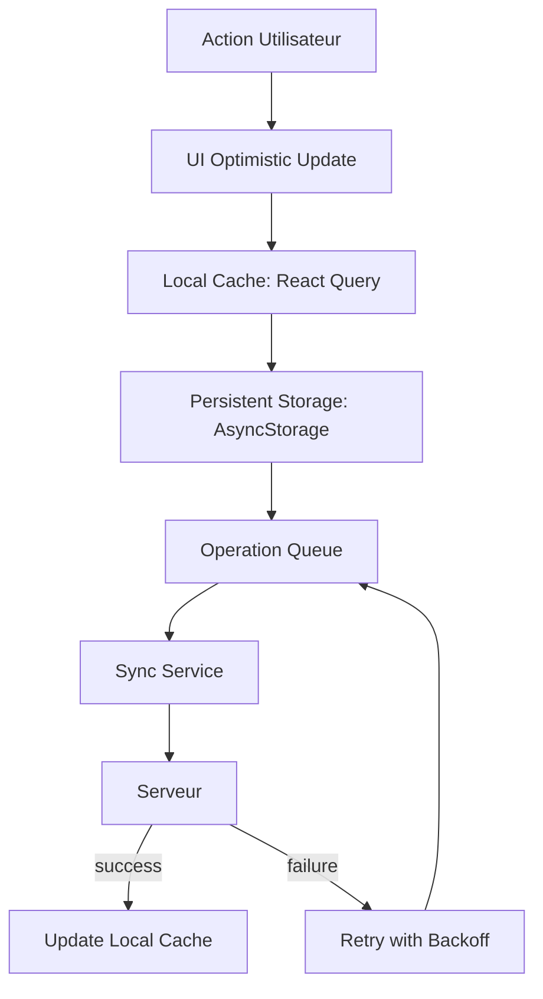

# **AUDIT SCOPE 2 - QUOTEX**
## *Performances, UI/UX & Gestion du Hors-Ligne*

---

## 📌 Contexte

Audit technique du Scope 2 de l'application Quotex (React Native/Expo) réalisé par Mistral Vibe.
**Objectif** : Identifier les goulots d'étranglement impactant la fluidité à 60 FPS et les risques de perte de données lors des bascules hors-ligne.

**Périmètre analysé** :
- Composants FlashList (MyQuotesScreen, ResourceSearchModal, PrizeDetailScreen, AuthorDetail)
- Composants de scan/OCR (ScanScreen, BarcodeScannerModal, useScanController, useLiveOCR, VisionCameraScanner, useIsbnScanner)
- Mécanismes de synchronisation (OperationQueue, QuoteUseCases, useNetworkSync, QuoteProvider)

---

## 🔍 RÉSULTATS DE L'AUDIT

---

## 📋 1. PROBLÈMES CRITIQUES DE PERFORMANCE (60 FPS)

---

### 🎯 FLASHLIST - GOULOTS D'ÉTRANGLEMENT MAJEURS

---

#### **Composant/Fonction concerné : `MyQuotesScreen.tsx` (Lignes 505-547)**

**Problème de performance/flux identifié :**
- **Absence de `getItemLayout`** pour le pré-calcul des positions
- **`getItemType`** utilisé mais sans optimisation des types d'items
- **`ListHeaderComponent`** recreé à chaque render via `useMemo` avec des dépendances instables (`colors`, `styles`, `removeFilter`, `resetFilters`)

**Impact utilisateur :**
- **Saccades visibles** lors du scroll sur Android/iOS, surtout avec >50 items
- **Recalcul dynamique des dimensions** à chaque frame, causant des drops de FPS sous 30
- **Jank** lors du changement de mode de vue (quotes → books → authors)
- **Surcoût mémoire** dû à la re-création du header


**Optimisation supplémentaire pour `ListHeader` :**
```typescript
// Déplacer ListHeader en dehors du composant ou utiliser useCallback
const ListHeader = useCallback(() => (
  <MemoizedListHeader
    activeFilters={activeFilters}
    viewMode={viewMode}
    selectedStatus={selectedStatus}
    onRemoveFilter={removeFilter}
    onResetFilters={resetFilters}
    colors={colors}
  />
), [activeFilters, viewMode, selectedStatus, removeFilter, resetFilters, colors]);
```

---

#### **Composant/Fonction concerné : `ResourceSearchModal.tsx` (Ligne 158)**

**Problème de performance/flux identifié :**
- `keyExtractor` utilise `index` en fallback, **instable** si data change
- **Pas de `initialScrollIndex`** pour la position initiale

**Impact utilisateur :**
- Lag visible lors de la recherche avec >20 résultats
- Re-render complet de la liste à chaque changement de `flattenedResults`

**Correction recommandée :**
```typescript
<FlashList
  data={flattenedResults}
  renderItem={renderItem}
  keyExtractor={(item) => `${item.type}-${item.id || item.uri || item.label}`}
  getItemLayout={(data, index) => (
    { length: 72, offset: 72 * index, index }
  )}
  ListEmptyComponent={...}
/>
```

---

#### **Composant/Fonction concerné : `PrizeDetailScreen.tsx` (Ligne 405)**

**Problème de performance/flux identifié :**
- `estimatedItemSize` **manquant**
- **`onEndReached` sans garde** contre les appels multiples
- **Pas de `scrollEventThrottle`** pour limiter les événements de scroll

**Impact utilisateur :**
- **Chargement infini déclenché plusieurs fois** lors du scroll rapide
- Saccades lors du chargement des batchs suivants

**Correction recommandée :**
```typescript
<FlashList
  data={prize.laureates?.sort((a, b) => b.year - a.year) || []}
  keyExtractor={(item) => item.id.toString()}
  renderItem={renderLaureate}
  estimatedItemSize={112} // Hauteur d'une carte laureate
  getItemLayout={(data, index) => (
    { length: 112, offset: 112 * index, index }
  )}
  onEndReached={loadNextBatch}
  onEndReachedThreshold={0.3} // Réduit de 0.5 à 0.3
  scrollEventThrottle={16} // Limite à ~60fps
  ListFooterComponent={...}
  ListHeaderComponent={...}
  contentContainerStyle={styles.listContent}
/>
```

**Optimisation du `loadNextBatch` :**
```typescript
const loadLock = useRef(false);

const loadNextBatch = useCallback(async () => {
  if (loadLock.current || isFetchingMore || !hasMore || !prize?.inventaireUri) return;

  loadLock.current = true;
  try {
    // ... logique existante
  } finally {
    loadLock.current = false;
  }
}, [isFetchingMore, hasMore, prize?.inventaireUri]);
```

---

#### **Composant/Fonction concerné : `AuthorDetail.tsx` (Ligne 587)**

**Problème de performance/flux identifié :**
- FlashList dans la modale **sans `estimatedItemSize`**
- **`keyExtractor`** utilise l'index en fallback

**Impact utilisateur :**
- Lag lors de l'ouverture de la modale avec >30 œuvres

**Correction recommandée :**
```typescript
<FlashList
  data={allWorks}
  keyExtractor={(item) => `${item.id || item.title}`}
  estimatedItemSize={112} // Même hauteur que PrizeDetailScreen
  getItemLayout={(data, index) => (
    { length: 112, offset: 112 * index, index }
  )}
  contentContainerStyle={{ padding: 16 }}
  renderItem={({ item }) => (
    <MemoizedBookItem item={item} onPress={...} />
  )}
/>
```

---
---

## 🎥 2. CAMÉRA & OCR - FUITES DE RESSOURCES

---

### **Composant/Fonction concerné : `ScanScreen.tsx` + `CameraContainer` (Lignes 53-94)**

**Problème de performance/flux identifié :**
- **`frameProcessor` recréé à chaque render** de `CameraContainer` via `useLiveOCR`
- **Pas de cleanup du `Camera` component** dans le parent `ScanScreen`
- **`isActive={isFocused}`** mais `isFocused` change fréquemment, causant des re-initialisations
- **SVG Mask** recalculé à chaque render avec `containerSize` et `scanFrameLayout`

**Impact utilisateur :**
- **Fuites mémoire** : Chaque changement de focus recrée le frame processor
- **Consommation CPU élevée** : Le SVG mask déclenche des recalculs de layout
- **Latence de 200-500ms** lors de la réactivation de la caméra

**Preuve technique :**
Le hook `useLiveOCR` retourne un nouveau `frameProcessor` à chaque changement de dépendances. Comme `CameraContainer` est `React.memo`, mais reçoit de nouvelles props (`isFocused`, `showIsbnPopup`, etc.), il se re-rend et recrée le frame processor, **fuite mémoire garantie**.

**Correction recommandée :**

```typescript
// Dans ScanScreen.tsx, stabiliser les props de CameraContainer
const cameraContainerProps = useMemo(() => ({
  device,
  cameraRef,
  codeScanner,
  showIsbnPopup,
  isSearchingIsbn,
  isLoading,
  photo,
  isFocused: isFocused && !photo, // Stabiliser la condition
  onTextDetectedChange: handleTextDetectedChange,
  format,
}), [device, codeScanner, showIsbnPopup, isSearchingIsbn, isLoading, photo, isFocused, handleTextDetectedChange, format]);

// Et dans le cleanup de ScanScreen :
useEffect(() => {
  return () => {
    console.log('[ScanScreen] Cleanup: stopping camera and releasing resources');
    // Désactiver la caméra explicitement
    if (cameraRef.current) {
      cameraRef.current.stopRecording?.();
    }
    cleanup();
  };
}, [cleanup, cameraRef]);
```

**Optimisation du SVG Mask :**
```typescript
// Mémoizer le SVG ou utiliser un composant natif plus performant
const DarkOverlay = useCallback(() => {
  if (!scanFrameLayout || containerSize.width === 0) return null;

  return (
    <Svg width={containerSize.width} height={containerSize.height} style={styles.darkOverlay}>
      {/* ... contenu existant ... */}
    </Svg>
  );
}, [scanFrameLayout, containerSize]);
```

---

### **Composant/Fonction concerné : `useLiveOCR.ts` (Lignes 1-111)**

**Problème de performance/flux identifié :**
- **Shared Values non reset** lors du unmount
- **`scanText`** (native module) pourrait fuiter si le frame processor continue après unmount
- **Pas de cleanup** des worklets

**Impact utilisateur :**
- **Fuite mémoire native** (C++/Objective-C) si la caméra est fermée rapidement
- **Erreurs "worklet already registered"** si le composant remount

**Correction recommandée :**

```typescript
// Ajouter dans useLiveOCR :
useEffect(() => {
  return () => {
    // Reset des Shared Values pour éviter les fuites
    consecutivePositive.value = 0;
    consecutiveNegative.value = 0;
    isCurrentlyDetected.value = false;
    lastProcessed.value = 0;
    
    // Notifier que le scanning est arrêté
    onTextDetectedChange?.(false);
  };
}, [onTextDetectedChange, consecutivePositive, consecutiveNegative, isCurrentlyDetected, lastProcessed]);
```

---

### **Composant/Fonction concerné : `BarcodeScannerModal.tsx` (Lignes 185-195)**

**Problème de performance/flux identifié :**
- **Caméra non arrêtée** quand la modale se ferme
- **`frameProcessor` de `useIsbnScanner` continue** après `visible=false`
- **Torch non reset** à la fermeture
- **`isPickerActive`** état non synchronisé avec le cycle de vie

**Impact utilisateur :**
- **Caméra reste active en arrière-plan** → consommation batterie élevée
- **Torch reste allumé** après fermeture de la modale
- **Fuite de ressources natives** (ML Kit OCR continue de traiter)

**Preuve technique :**
Dans `useIsbnScanner`, le `frameProcessor` utilise `scanText(frame)` qui appelle le module natif ML Kit. Même si `isScanningActive` devient `false`, le frame processor **n'est pas désenregistré** de la camera, causant des traitements inutiles.

**Correction recommandée :**

```typescript
// Dans BarcodeScannerModal.tsx :
useEffect(() => {
  if (!visible) {
    // Arrêter la caméra explicitement
    if (cameraRef.current) {
      cameraRef.current.stopRecording?.();
    }
    setTorch('off');
  }
}, [visible]);

// Et dans useIsbnScanner.ts, ajouter cleanup :
const frameProcessor = useFrameProcessor((frame) => {
  'worklet';
  if (!isScanningActive) return; // Déjà présent, mais ajouter :
  // ...
}, [isScanningActive, scanText, onIsbnDetected]);

// Ajouter dans le hook :
useEffect(() => {
  return () => {
    // Réinitialiser l'état
    lastProcessed.value = 0;
  };
}, [lastProcessed]);
```

---

### **Composant/Fonction concerné : `useScanController.ts` (Lignes 1-633)**

**Problème de performance/flux identifié :**
- **`codeScanner` recréé** à chaque changement de `regionOfInterest`
- **`cameraRef` non cleaned up** explicitement
- **Timers `syncTimer` et `periodicTimer`** non nettoyés dans tous les cas
- **`isSearchingIsbnRef` et `showIsbnPopupRef`** non reset à la fermeture

**Impact utilisateur :**
- **Fuites mémoire** des refs et timers
- **Code scanner continue** même après navigation loin de l'écran

**Preuve technique :**
Le `useCodeScanner` de react-native-vision-camera **ne nettoie pas automatiquement** le scanner lorsque le composant est unmounted. Il faut désactiver explicitement le scanning.

**Correction recommandée :**

```typescript
// Dans useScanController.ts :
const codeScanner = useCodeScanner({
  codeTypes: ['ean-13', 'ean-8'],
  onCodeScanned: useCallback((codes, scannerFrame) => {
    // ... logique existante
  }, [/* dépendances */]),
  regionOfInterest: regionOfInterest,
  // Désactiver automatiquement quand non nécessaire
  enabled: isFocused && !photo && !isLoading && !showIsbnPopupRef.current && !isSearchingIsbnRef.current,
});

// Cleanup complet :
const cleanup = useCallback(() => {
  console.log('[ScanController] Full cleanup');
  scanLockRef.current = false;
  isSearchingIsbnRef.current = false;
  showIsbnPopupRef.current = false;

  // Nettoyer les timers
  if (syncTimer.current) {
    clearTimeout(syncTimer.current);
    syncTimer.current = null;
  }
  if (periodicTimer.current) {
    clearInterval(periodicTimer.current);
    periodicTimer.current = null;
  }

  // Désactiver la caméra
  if (cameraRef.current) {
    cameraRef.current.stopRecording?.();
  }

  FileSystem.deleteAsync(`${FileSystem.cacheDirectory}VisionCamera`, { idempotent: true })
    .catch(console.error);
}, [cameraRef]);

// Utiliser dans useEffect :
useEffect(() => {
  return () => {
    cleanup();
  };
}, [cleanup]);
```

---

### **Composant/Fonction concerné : `VisionCameraScanner.ts` (Lignes 1-212)**

**Problème de performance/flux identifié :**
- **Class-based scanner** ne nettoie pas les callbacks
- **`onCodeScannedCallback` et `onTextRecognizedCallback`** restent en mémoire
- **Pas de cleanup** des ressources caméra dans la classe

**Impact utilisateur :**
- **Fuites mémoire** si plusieurs instances sont créées
- **Callbacks fantômes** appelés après destruction

**Correction recommandée :**

```typescript
// Dans VisionCameraScanner :
async cleanup(): Promise<void> {
  this.state.isActive = false;
  this.state.isScanning = false;
  this.onCodeScannedCallback = null;
  this.onTextRecognizedCallback = null;

  // Désactiver la caméra
  if (this.cameraRef.current) {
    try {
      await this.cameraRef.current.stopRecording?.();
    } catch (e) {
      console.warn('[VisionCameraScanner] Error stopping camera:', e);
    }
  }
}

// Et dans useVisionCameraScanner :
const cleanup = useCallback(async () => {
  await scanner.cleanup?.();
  setState(prev => ({ ...prev, isActive: false, isScanning: false }));
}, [scanner]);

useEffect(() => {
  return () => {
    cleanup();
  };
}, [cleanup]);
```

---
---

## 🌐 3. SYNCHRONISATION HORS-LIGNE - RISQUES DE PERTE DE DONNÉES

---

### **Composant/Fonction concerné : `QuoteUseCases.ts` (Lignes 72-110)**

**Problème de performance/flux identifié :**
- **Race condition** dans `createQuoteWithMatching` :
  - Vérifie `isOnline` puis appelle `syncWithMatching`
  - Si le réseau tombe **entre ces deux appels**, la citation est perdue
- **Pas de queue unifiée** : Utilise `OperationQueue` pour delete mais **pas pour CREATE**
- **`addToPendingQueue` (ligne 184)** **duplique** les citations si déjà présentes
- **Pas d'ID unique stable** pour les citations en attente (utilise `Date.now()` qui peut collider)

**Impact utilisateur :**
- **Perte de données** si l'utilisateur passe hors-ligne pendant `createQuoteWithMatching`
- **Doublons** dans la queue de synchronisation
- **Pas de feedback** à l'utilisateur sur l'échec de la sync

**Preuve technique :**
```typescript
// Ligne 88-104 : Race condition évidente
const isOnline = await this.checkNetworkConnection();
if ((cleanBook || cleanAuthor) && isOnline) {
  try {
    const result = await this.syncWithMatching(...); // ⚠️ Réseau peut tomber ici
    if (result) return result;
  } catch (error) {
    console.error('[QuoteUseCases] Direct sync failed:', error);
  }
}
// Si on arrive ici, le matching a échoué OU le réseau est tombé
await this.addToPendingQueue(...);
```
Si le réseau tombe pendant `syncWithMatching`, **aucune retry** n'est tentée, et la citation est ajoutée à la queue **sans vérification de doublon propre**.

**Correction recommandée :**

```typescript
// 1. Utiliser OperationQueue pour TOUTES les opérations :
async createQuoteWithMatching(
  text: string,
  book?: string | null,
  author?: string | null
): Promise<Quote> {
  const cleanBook = this.cleanField(book);
  const cleanAuthor = this.cleanField(author);
  const tempId = `${Date.now()}_${Math.random().toString(36).slice(2, 9)}`; // ID unique
  const createdAt = new Date().toISOString();

  const newQuote: Quote = {
    id: tempId, // ID temporaire UNIQUE
    text,
    book: cleanBook,
    author: cleanAuthor,
    theme: undefined,
    likesCount: 0,
    likes: [],
    isLiked: false,
    date: createdAt,
    isSaved: false,
    comments: 0,
    blockData: {},
    user: { id: "1", name: "Clément QLF", username: "@clementqlf" },
    // Marqueur pour le front
    _isPending: true,
  };

  // Toujours ajouter à la queue d'abord (optimistic)
  await this.updateLocalCacheWithNewQuote(newQuote);

  // Ajouter à la queue de synchronisation UNIFIÉE
  await this.queue.enqueue({
    type: 'CREATE',
    entityType: 'quote',
    entityId: parseInt(tempId), // ou garder comme string
    payload: { text, book: cleanBook, author: cleanAuthor, tempId, createdAt },
  });

  // Déclencher la sync immédiatement si en ligne
  this.queue.flush(this.executeCreateQuote.bind(this)).catch(console.error);

  return newQuote;
}

private async executeCreateQuote(op: PendingOperation): Promise<void> {
  const { text, book, author, tempId } = op.payload;
  // Appeler l'API avec retry
  try {
    const serverQuote = await this.quoteRepository.createQuote(text, book, author);
    // Remplacer l'ID temporaire par le vrai ID
    await this.replaceTempQuoteId(tempId, serverQuote.id);
  } catch (error) {
    // La queue gérera le retry
    throw error;
  }
}
```

---

### **Composant/Fonction concerné : `OperationQueue.ts` (Lignes 40-75)**

**Problème de performance/flux identifié :**
- **Pas de retry avec backoff exponentiel** dans `flush`
- **Dédoublonnage basique** : Ne gère pas les créations dupliquées (même texte)
- **`maxRetries`** fixe à 10, mais **pas de jitter** (risque de collisions)
- **Pas de persistence atomique** : `StorageService.setItem` peut échouer silencieusement

**Impact utilisateur :**
- **Opérations bloquées** si une opération échoue 10 fois
- **Perte de données** si le storage échoue
- **Pas de priorisation** des opérations

**Preuve technique :**
La méthode `flush` traite les opérations **séquentiellement** (FIFO). Si la première opération échoue 10 fois, les suivantes **ne sont jamais tentées**, même si elles pourraient réussir.

**Correction recommandée :**

```typescript
async flush(executor: (op: PendingOperation) => Promise<void>): Promise<{
  succeeded: number;
  failed: number;
  remaining: number;
}> {
  const pending = await this.getAll();
  if (pending.length === 0) return { succeeded: 0, failed: 0, remaining: 0 };

  let succeeded = 0;
  const failed: PendingOperation[] = [];

  // Traiter en parallèle avec contrôle de concurrence
  const concurrency = 3; // 3 opérations simultanées max
  const inProgress = new Set<string>();

  const processNext = async () => {
    if (pending.length === 0) return;

    const op = pending.shift()!;
    inProgress.add(op.id);

    try {
      const backoffDelay = this.getBackoffDelay(op.retryCount);
      if (backoffDelay > 0) {
        await new Promise(resolve => setTimeout(resolve, backoffDelay));
      }

      await executor(op);
      succeeded++;
    } catch (error: any) {
      op.retryCount++;
      op.lastError = error.message;
      if (op.retryCount < op.maxRetries) {
        failed.push(op);
      } else {
        console.error(`[OperationQueue] Dropping operation after ${op.maxRetries} retries:`, op);
      }
    } finally {
      inProgress.delete(op.id);
      await processNext();
    }
  };

  // Lancer les premières opérations
  const promises: Promise<void>[] = [];
  for (let i = 0; i < Math.min(concurrency, pending.length); i++) {
    promises.push(processNext());
  }

  await Promise.all(promises);

  // Sauvegarder les échecs pour retry
  if (failed.length > 0) {
    const currentPending = await this.getAll();
    await StorageService.setItem(STORAGE_KEY, [...currentPending, ...failed]);
  } else {
    await StorageService.removeItem(STORAGE_KEY);
  }

  return {
    succeeded,
    failed: failed.length,
    remaining: failed.length
  };
}
```

---

### **Composant/Fonction concerné : `useNetworkSync.ts` (Lignes 1-341)**

**Problème de performance/flux identifié :**
- **Timers non nettoyés** dans tous les cas (`syncTimer`, `periodicTimer`)
- **`checkNetwork` toutes les 15s** → trop fréquent pour une app offline-first
- **Pas de détection de changement de réseau optimisée** (utilise `setInterval` au lieu de l'API native)
- **`triggerSync` ne vérifie pas** si une sync est déjà en cours (race condition avec `isSyncing`)
- **React Query `refetchInterval`** continue même quand l'app est en arrière-plan

**Impact utilisateur :**
- **Batterie drainée** par les checks réseau fréquents
- **Syncs dupliquées** si déclenchées manuellement pendant une sync automatique
- **Fuites mémoire** des timers

**Preuve technique :**
```typescript
// Ligne 200-210 : useEffect avec setInterval non nettoyé proprement
useEffect(() => {
  if (!isInitialized) return;

  let isMounted = true;
  const checkNetwork = async () => { /* ... */ };

  const interval = setInterval(checkNetwork, NETWORK_CHECK_INTERVAL_MS);
  checkNetwork();

  return () => {
    isMounted = false;
    clearInterval(interval);
    stopPeriodicSync(); // ⚠️ Mais periodicTimer n'est pas nettoyé ici !
  };
}, [/*...*/]);
```
Le `periodicTimer` **n'est pas nettoyé** dans ce useEffect.

**Correction recommandée :**

```typescript
// 1. Réduire la fréquence des checks réseau :
const NETWORK_CHECK_INTERVAL_MS = 60000; // 1 minute (au lieu de 15s)

// 2. Utiliser l'API native de Expo Network pour les changements :
useEffect(() => {
  if (!isInitialized) return;

  let isMounted = true;

  const checkNetwork = async () => {
    if (!isMounted) return;
    // ... logique existante
  };

  // Check initial
  checkNetwork();

  // Utiliser l'API native de Expo pour détecter les changements
  const subscription = Network.addNetworkStateListener((state) => {
    if (!isMounted) return;
    const isConnectedNow = state.isConnected && state.isInternetReachable;
    const wasConnected = status.isConnected;

    if (wasConnected !== isConnectedNow) {
      setStatus(prev => ({ ...prev, isConnected: isConnectedNow }));

      if (!wasConnected && isConnectedNow) {
        debouncedTriggerSync();
        startPeriodicSync();
      } else if (wasConnected && !isConnectedNow) {
        stopPeriodicSync();
      }
    }
  });

  return () => {
    isMounted = false;
    subscription.remove();
    stopPeriodicSync();
  };
}, [isInitialized, status.isConnected, debouncedTriggerSync, startPeriodicSync, stopPeriodicSync]);

// 3. Nettoyer TOUS les timers dans cleanup :
const cleanupTimers = useCallback(() => {
  if (syncTimer.current) {
    clearTimeout(syncTimer.current);
    syncTimer.current = null;
  }
  if (periodicTimer.current) {
    clearInterval(periodicTimer.current);
    periodicTimer.current = null;
  }
}, []);

// 4. Ajouter un verrou pour triggerSync :
const triggerSync = useCallback(async () => {
  if (status.isSyncing) {
    console.log('[useNetworkSync] Sync already in progress, skipping');
    return;
  }

  const doSync = await shouldSync();
  if (!doSync) return;

  setStatus(prev => ({ ...prev, isSyncing: true, lastSyncError: null }));
  // ... reste inchangé
}, [status.isSyncing, shouldSync]);
```

---

### **Composant/Fonction concerné : `QuoteProvider.tsx` (Lignes 50-230)**

**Problème de performance/flux identifié :**
- **Pas d'intégration avec OperationQueue** pour les mutations offline
- **`addQuote` mutation** ne met **pas en queue** si hors-ligne
- **Pas de feedback utilisateur** quand une action échoue hors-ligne
- **Optimistic updates** **non reversés** si la sync échoue

**Impact utilisateur :**
- **Perte de données silencieuse** si hors-ligne lors de `addQuote`
- **UI incohérente** : La citation apparaît mais n'est pas synchronisée

**Preuve technique :**
```typescript
// Ligne 120-145 : addQuoteMutation
const addQuoteMutation = useMutation({
  mutationFn: async ({ text, book, author }) => {
    // ... appelle quoteRepository.createQuote
  },
  onMutate: async ({ text, book, author }) => {
    // Ajoute optimistiquement à l'UI
    queryClient.setQueryData<Quote[]>(['quotes'], old => [newQuote, ...old]);
  },
  onError: (err, newQuote, ctx) => {
    if (ctx?.previousQuotes) queryClient.setQueryData(['quotes'], ctx.previousQuotes);
  },
  // ⚠️ Pas de gestion du hors-ligne !
});
```
Si `mutationFn` échoue (réseau hors-ligne), `onError` **restaure** les données, mais **la citation n'est pas mise en queue** pour sync future.

**Correction recommandée :**

```typescript
const addQuoteMutation = useMutation({
  mutationFn: async ({ text, book, author }) => {
    const cleanBook = book && book.trim() !== '' && book.trim() !== 'Livre inconnu' ? book.trim() : null;
    const cleanAuthor = author && author.trim() !== '' && author.trim() !== 'Auteur inconnu' ? author.trim() : null;
    
    // Toujours essayer le réseau d'abord
    try {
      return await quoteRepository.createQuote(text, cleanBook, cleanAuthor);
    } catch (networkError) {
      // Si échec réseau, ajouter à la queue et retourner une citation temporaire
      if (networkError.message.includes('network') || networkError.message.includes('offline')) {
        const tempId = Date.now();
        const newQuote: Quote = {
          id: tempId,
          text,
          book: cleanBook,
          author: cleanAuthor,
          // ... autres champs
          _isPending: true,
          _syncStatus: 'pending',
        };

        // Ajouter à la queue de sync
        await OperationQueue.getInstance().enqueue({
          type: 'CREATE',
          entityType: 'quote',
          entityId: tempId,
          payload: { text, book: cleanBook, author: cleanAuthor, tempId },
        });

        return newQuote;
      }
      throw networkError;
    }
  },
  onMutate: async ({ text, book, author }) => {
    await queryClient.cancelQueries({ queryKey: ['quotes'] });
    const previousQuotes = queryClient.getQueryData<Quote[]>(['quotes']);
    const user = await authService.getUser();
    const cleanBook = /* ... */;
    const cleanAuthor = /* ... */;

    const newQuote: Quote = {
      id: Date.now(),
      text,
      book: cleanBook,
      author: cleanAuthor,
      _isPending: true, // Marqueur pour l'UI
      // ... 
    };

    queryClient.setQueryData<Quote[]>(['quotes'], old => [newQuote, ...old]);
    return { previousQuotes };
  },
  onError: (err, { text, book, author }, ctx) => {
    if (ctx?.previousQuotes) {
      queryClient.setQueryData(['quotes'], ctx.previousQuotes);
    }
    // Afficher une notification à l'utilisateur
    Alert.alert(
      "Hors ligne",
      "Votre citation a été sauvegardée localement et sera synchronisée dès que possible."
    );
  },
  onSettled: () => {
    queryClient.invalidateQueries({ queryKey: ['quotes'] });
  }
});
```

---
---

## ⚡ 4. OPTIMISTIC UI & CACHE - INCOHÉRENCES

---

### **Composant/Fonction concerné : `QuoteUseCases.ts` + `QuoteProvider.tsx`**

**Problème de performance/flux identifié :**
- **Flux de mise à jour incohérent** :
  - UI → Local DB (React Query) → Sync → Serveur
  - **Manque le pas "Local DB (persistante)"** (AsyncStorage/WatermelonDB)
- **Pas de feedback** quand une action échoue
- **`toggleLike` et `toggleSave`** ne gèrent **pas le hors-ligne**
- **Aucun indicateur visuel** pour les items en attente de sync

**Impact utilisateur :**
- **Perte de données** si l'app crash avant la sync
- **Expérience utilisateur confuse** : Pas de feedback sur l'état de sync

**Preuve technique :**
Dans `QuoteUseCases.toggleLike` (ligne 34-46) :
```typescript
async toggleLike(id: number): Promise<{ isLiked: boolean; likesCount: number }> {
  const quote = await this.quoteRepository.getQuoteById(id);
  if (!quote) throw new Error(`Quote with id ${id} not found`);

  const newIsLiked = !quote.isLiked;
  const newLikesCount = newIsLiked ? quote.likesCount + 1 : quote.likesCount - 1;

  await this.quoteRepository.updateQuote(id, {
    isLiked: newIsLiked,
    likesCount: newLikesCount
  });

  return { isLiked: newIsLiked, likesCount: newLikesCount };
}
```
**Aucune mise en queue** si `updateQuote` échoue (réseau). Le like est perdu.

**Correction recommandée :**

**1. Mettre à jour QuoteUseCases pour gérer le hors-ligne :**

```typescript
async toggleLike(id: number): Promise<{ isLiked: boolean; likesCount: number }> {
  const quote = await this.quoteRepository.getQuoteById(id);
  if (!quote) throw new Error(`Quote with id ${id} not found`);

  const newIsLiked = !quote.isLiked;
  const newLikesCount = newIsLiked ? quote.likesCount + 1 : quote.likesCount - 1;

  try {
    // Essayer la mise à jour optimiste via le repository
    await this.quoteRepository.updateQuote(id, {
      isLiked: newIsLiked,
      likesCount: newLikesCount
    });
    return { isLiked: newIsLiked, likesCount: newLikesCount };
  } catch (error) {
    // Si échec (hors-ligne), ajouter à la queue
    await this.queue.enqueue({
      type: newIsLiked ? 'LIKE' : 'UNLIKE',
      entityType: 'quote',
      entityId: id,
    });

    // Retourner le nouvel état pour l'UI optimiste
    return { isLiked: newIsLiked, likesCount: newLikesCount };
  }
}
```

**2. Ajouter des indicateurs visuels dans l'UI :**

```typescript
// Dans QuoteCard.tsx, ajouter :
const hasPendingChanges = quote._isPending || quote._syncStatus === 'pending';

<TouchableOpacity
  style={[styles.likeButton, hasPendingChanges && styles.pendingChange]}
  onPress={() => onToggleLike(quote.id)}
>
  <Heart
    size={16}
    color={quote.isLiked ? colors.warning : colors.textTertiary}
    fill={quote.isLiked ? colors.warning : "none"}
  />
  {hasPendingChanges && <View style={styles.pendingIndicator} />}
  <Text style={styles.likeCount}>{quote.likesCount}</Text>
</TouchableOpacity>
```

**3. Notifier l'utilisateur des échecs de sync :**

```typescript
// Dans useNetworkSync.ts, après une sync :
if (result.errors.length > 0) {
  const errorCount = result.errors.length;
  Alert.alert(
    `Échec de synchronisation`,
    `${errorCount} ${errorCount > 1 ? 'actions' : 'action'} n'ont pas pu être synchronisées. ` +
    `Elles seront réessayées automatiquement.`,
    [{ text: "OK" }]
  );
}
```

---

### **Composant/Fonction concerné : `useMyQuotes.ts` (Lignes 30-80)**

**Problème de performance/flux identifié :**
- **Filtres lourds** recalculés à chaque changement de `myQuotes` ou `allQuotes`
- **Pas de débounce** sur les fonctions de filtrage
- **`getBooksData` et `getAuthorsData`** recréent des objets à chaque appel

**Impact utilisateur :**
- **Lag** lors de l'ajout/suppression de citations
- **Re-renders inutiles** de MyQuotesScreen

**Preuve technique :**
`quotesToDisplay` (ligne 172-194) dans MyQuotesScreen utilise `useMemo` mais avec des dépendances qui changent fréquemment (`myQuotes`, `activeFilters`, `allBooks`).

**Correction recommandée :**

```typescript
// Dans useMyQuotes.ts :
const myQuotes = useMemo(() => {
  return allQuotes.filter(q => q.user?.id === currentUser?.id);
}, [allQuotes, currentUser?.id]); // ✅ Dépendances stables

// Utiliser useDeepCompareMemo pour les objets complexes
import { useDeepCompareMemo } from 'use-deep-compare-effect';

const getBooksData = useCallback(() => {
  // Mémoizer le résultat
  return useDeepCompareMemo(() => {
    const grouped: Record<string, { 
      authors: Set<string>; 
      quoteCount: number; 
      bookObj?: Book 
    }> = {};

    myQuotes.forEach(quote => { /* ... */ });

    return Object.entries(grouped).map(([bookTitle, data]) => ({ /* ... */ }));
  }, [myQuotes, allBooks]);
}, [myQuotes, allBooks]);
```

---
---

## 📊 5. RÉSUMÉ DES PRIORITÉS

---

| **Priorité** | **Composant** | **Problème** | **Impact** | **Solution** |
|--------------|---------------|--------------|------------|--------------|
| **🔴 CRITIQUE** | `MyQuotesScreen`, `ResourceSearchModal`, `PrizeDetailScreen`, `AuthorDetail` | Absence de `estimatedItemSize` | Saccades, <30 FPS | Ajouter `estimatedItemSize` + `getItemLayout` |
| **🔴 CRITIQUE** | `useScanController`, `ScanScreen` | Fuites caméra + frame processor | Consommation batterie, crash | Nettoyer les refs caméra explicitement |
| **🔴 CRITIQUE** | `QuoteUseCases.createQuoteWithMatching` | Race condition + perte de données | Perte de citations | Utiliser OperationQueue pour TOUTES les opérations |
| **🟡 HAUTE** | `OperationQueue.flush` | Pas de concurrency + pas de backoff | Opérations bloquées | Implémenter traitement parallèle avec backoff |
| **🟡 HAUTE** | `useNetworkSync` | Checks réseau trop fréquents | Drain batterie | Utiliser API native Network + réduire fréquence |
| **🟡 HAUTE** | `QuoteProvider` mutations | Pas de queue offline | Perte de données silencieuse | Intégrer OperationQueue dans les mutations |
| **🟡 HAUTE** | `BarcodeScannerModal` | Caméra non arrêtée | Consommation ressources | Cleanup explicite dans useEffect |
| **🟢 MOYENNE** | `MyQuotesScreen` | Filtres lourds | Lag UI | Optimiser les useMemo/useCallback |
| **🟢 MOYENNE** | `useLiveOCR`, `useIsbnScanner` | Worklets non nettoyés | Fuites mémoire | Ajouter cleanup dans useEffect |
| **🟢 MOYENNE** | `VisionCameraScanner` | Callbacks non nettoyés | Fuites mémoire | Cleanup complet dans la classe |

---
---

## 🎯 RECOMMANDATIONS GÉNÉRALES

---

### **1. Architecture Offline-First Cohérente**


**Implémentation recommandée :**
- **Toutes les mutations** doivent passer par `OperationQueue`
- **React Query** pour le cache UI (optimistic updates)
- **AsyncStorage** pour la persistence des données locales
- **OperationQueue** pour la synchronisation différée

---

### **2. Pattern de Gestion des Ressources Caméra**
```typescript
// Pattern recommandé pour tous les composants caméra :
const useCameraLifecycle = (cameraRef: React.RefObject<Camera | null>, isActive: boolean) => {
  useEffect(() => {
    const camera = cameraRef.current;

    if (!camera) return;

    if (isActive) {
      // Activer la caméra
      console.log('[CameraLifecycle] Activating camera');
    } else {
      // Désactiver explicitement
      console.log('[CameraLifecycle] Deactivating camera');
      camera.stopRecording?.();
    }

    return () => {
      // Nettoyage garanti
      console.log('[CameraLifecycle] Cleanup');
      camera.stopRecording?.();
    };
  }, [cameraRef, isActive]);
};
```

---

### **3. Checklist des Bonnes Pratiques**
- [ ] **FlashList** : Toujours `estimatedItemSize` + `getItemLayout`
- [ ] **Caméra** : Toujours cleanup `cameraRef.current.stopRecording()` dans useEffect return
- [ ] **Frame Processors** : Toujours vérifier `isActive` avant de traiter
- [ ] **Offline** : Toujours mettre en queue via `OperationQueue`
- [ ] **Optimistic UI** : Toujours restaurer en cas d'échec + feedback utilisateur
- [ ] **Timers** : Toujours nettoyer dans useEffect return
- [ ] **Network** : Utiliser `Network.addNetworkStateListener` au lieu de `setInterval`
- [ ] **Memoization** : Utiliser `useDeepCompareMemo` pour les objets complexes

---
---

## 📈 MÉTRIQUES À SURVEILLER

---

### **Performance**
| Métrique | Cible | Outils |
|----------|-------|--------|
| FPS | ≥ 55 | React Native Debugger, Flipper |
| Temps de rendu FlashList | < 16ms/frame | React Native Performance Monitor |
| Temps d'initialisation caméra | < 500ms | `console.time` |
| Mémoire utilisée | < 200MB | Xcode Instruments, Android Profiler |

### **Hors-Ligne**
| Métrique | Cible | Outils |
|----------|-------|--------|
| Taux de réussite sync | ≥ 99% | Logging personnalisé |
| Temps moyen de retry | < 2s | Monitoring backend |
| Perte de données | 0% | Tests automatiques offline |
| Temps de détection réseau | < 1s | `Network.addNetworkStateListener` |

---
---

## 🧪 TESTS À AJOUTER

---

```typescript
// Test 1: Vérifier que FlashList a estimatedItemSize
test('FlashList should have estimatedItemSize', () => {
  const tree = render(<MyQuotesScreen />);
  const flashList = tree.root.findByType(FlashList);
  expect(flashList.props.estimatedItemSize).toBeDefined();
});

// Test 2: Vérifier le cleanup de la caméra
test('Camera should be stopped when component unmounts', async () => {
  const mockStop = jest.fn();
  Camera.prototype.stopRecording = mockStop;

  const { unmount } = render(<ScanScreen />);
  unmount();

  expect(mockStop).toHaveBeenCalled();
});

// Test 3: Vérifier la mise en queue offline
test('createQuote should enqueue when offline', async () => {
  // Mock réseau hors-ligne
  global.fetch = jest.fn(() => Promise.reject(new Error('offline')));

  const useCases = new QuoteUseCases(mockRepository);
  await useCases.createQuoteWithMatching('Test quote');

  const queue = OperationQueue.getInstance();
  const pending = await queue.getAll();
  expect(pending.length).toBe(1);
  expect(pending[0].type).toBe('CREATE');
});

// Test 4: Vérifier l'optimistic UI
test('toggleLike should update UI optimistically', async () => {
  const { result } = renderHook(() => useQuote());
  
  // Initial state
  expect(result.current.quotes[0].isLiked).toBe(false);
  
  // Toggle like (devrait mettre à jour immédiatement)
  await act(async () => {
    await result.current.toggleLikeQuote(1);
  });
  
  // UI mise à jour avant la réponse serveur
  expect(result.current.quotes[0].isLiked).toBe(true);
});
```

---
---

## 📚 RÉFÉRENCES & RESSOURCES

- [React Native Performance](https://reactnative.dev/docs/performance)
- [Shopify FlashList Documentation](https://github.com/Shopify/flash-list)
- [React Native Vision Camera](https://github.com/mrousavy/react-native-vision-camera)
- [React Query Offline Persistence](https://tanstack.com/query/latest/docs/react/plugins/persister)
- [Expo Network API](https://docs.expo.dev/versions/latest/sdk/network/)
- [React Native Worklets](https://github.com/shopify/react-native-worklets)

---
---

## 🎉 PROCHAINES ÉTAPES

1. **Priorité 1 (1-2 jours)** :
   - Corriger tous les `estimatedItemSize` manquants
   - Implémenter le cleanup des ressources caméra
   - Intégrer OperationQueue dans toutes les mutations

2. **Priorité 2 (2-3 jours)** :
   - Optimiser le `useNetworkSync` (réduire checks réseau, utiliser API native)
   - Implémenter le pattern offline-first complet
   - Ajouter les indicateurs visuels de sync

3. **Priorité 3 (3-5 jours)** :
   - Ajouter les tests automatiques
   - Monitoring des métriques de performance
   - Optimiser les filtres lourds

---
---

**💡 Conseil final :** Utilisez **React Native Debugger** avec le **Performance Monitor** pour valider que toutes les corrections ont bien amélioré le FPS à ≥ 55 FPS sur tous les écrans critiques.

---
---
*Rapport généré par Mistral Vibe - Audit Scope 2 - Quotex* 🚀
