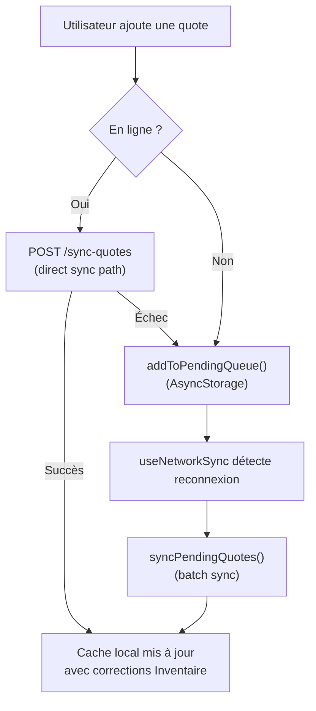
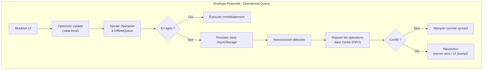
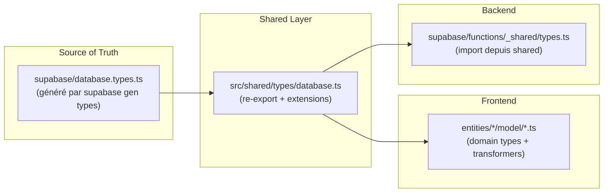

# 🔍 Audit — Gestion de Données & Communication Client ↔ Backend

> **Application :** Quotex · **Stack :** Expo 55, React Native 0.83, Supabase  
> **Date :** 31 mai 2026

---

## Table des matières

1. [Offline-First & Conflits](#1-offline-first--conflits)
2. [Type-Safety End-to-End](#2-type-safety-end-to-end)
3. [Sécurité (RLS & Edge Functions)](#3-sécurité-rls--edge-functions)
4. [Optimisation des Requêtes & Cache](#4-optimisation-des-requêtes--cache)
5. [Proposition : Intégration TanStack Query](#5-proposition--intégration-tanstack-query)
6. [Exemples de Code](#6-exemples-de-code)

---

## 1. Offline-First & Conflits

### 1.1 Architecture actuelle



### 1.2 Forces de l'implémentation actuelle

| Aspect | Détail |
|--------|--------|
| **Queue persistante** | `PENDING_QUOTES` stockées dans AsyncStorage — survit aux redémarrages ✅ |
| **Retry avec compteur** | `retryCount` incrémenté à chaque échec — base pour un backoff ✅ |
| **Debounce réseau** | 5 secondes de délai avant sync après reconnexion — évite les flaps ✅ |
| **Sync périodique** | Toutes les 5 minutes quand en ligne ✅ |
| **Corrections Inventaire** | Le serveur corrige auteur/livre et renvoie les corrections au client ✅ |

### 1.3 Problèmes critiques identifiés

#### 🔴 P0 — Aucune gestion de conflit serveur

> [!CAUTION]
> **Risque de perte de données.** Si un utilisateur modifie une quote hors-ligne (like, save, update) et que le serveur a changé entre-temps, c'est "last write wins" sans aucun mécanisme de détection ou résolution.

**Scénario concret :**
1. Utilisateur A like la quote #42 hors-ligne → stocké dans AsyncStorage
2. Pendant ce temps, l'auteur/livre de la quote #42 est corrigé côté serveur
3. Quand le réseau revient, `getQuotes()` écrase tout le cache local avec les données serveur
4. Le like hors-ligne est **perdu** car jamais envoyé au serveur

**Fichier concerné :** [QuoteService.ts](file:///Users/chantreau/quotex/src/entities/quote/api/QuoteService.ts#L83-L132) — La méthode `getQuotes()` fait un remplacement total du cache sans merge.

#### 🔴 P0 — Pas de queue offline pour les mutations (like, save, delete, update)

Seul `addQuote` est géré par la pending queue. Les autres mutations échouent silencieusement :

```typescript
// toggleLike — Ligne 158-184 de QuoteService.ts
async toggleLike(id: number): Promise<boolean> {
    try {
        const response = await fetch(`${this.API_URL}/${id}/like`, {
            method: 'POST', headers
        });
        if (response.ok) { /* ... */ }
    } catch (e) {
        console.error('Error toggling like:', e);
        // ⚠️ Fallback local uniquement — jamais re-synchronisé !
    }
    // Fallback local legacy — PERDU au prochain getQuotes()
}
```

Mêmes problèmes pour : `toggleSave`, `deleteQuote`, `updateQuote`.

#### 🟡 P1 — Bug dans `useNetworkSync` : type mismatch

```typescript
// useNetworkSync.ts — Ligne 194
if (isConnected && pendingCount.length > 0) {
//                  ^^^^^^^^^ pendingCount est un number, pas un array !
```

`getPendingQuotesCount()` retourne un `number`, mais le code traite la valeur comme un tableau. Le résultat : la condition `pendingCount.length` est toujours `undefined`, donc la sync au démarrage **ne se déclenche jamais**.

#### 🟡 P1 — Stale closures dans `useNetworkSync`

Les callbacks `startPeriodicSync`, `debouncedTriggerSync` etc. stockent des timers dans le state React (`useState`). Les `useCallback` dépendent les uns des autres créant des closures périmées. Le timer de sync périodique peut se multiplier si `status.isConnected` change plusieurs fois.

#### 🟡 P1 — Pas de backoff exponentiel

Le `retryCount` est incrémenté mais jamais utilisé pour espacer les retries. Après 100 échecs, on réessaie toujours immédiatement.

#### 🟡 P1 — Pas de limite max de retries

Les quotes en erreur restent dans la queue indéfiniment. Après N échecs, elles devraient être archivées ou signalées à l'utilisateur.

#### 🟠 P2 — `checkConnection()` ping Google.com

```typescript
// QuoteService.ts — Ligne 423-439
private async checkConnection(): Promise<boolean> {
    const response = await fetch('https://www.google.com', {
        method: 'HEAD', signal: controller.signal,
    });
}
```

Problème : ping un domaine externe au lieu du serveur Supabase. Le serveur Supabase peut être down alors que Google est accessible.

### 1.4 Recommandations — Gestion de conflits



---

## 2. Type-Safety End-to-End

### 2.1 État actuel

> [!WARNING]
> **Les types FE et BE sont complètement déconnectés.** Le frontend définit ses interfaces dans `src/entities/*/model/*.ts`, tandis que le backend (Edge Functions Deno) n'a **aucun fichier de types partagé** et utilise exclusivement `any`.

| Couche | Typage | Risque |
|--------|--------|--------|
| Frontend Models | `Quote`, `Author`, `Book` interfaces | Bien structuré ✅ |
| Frontend Services | `mapQuoteFromServer(q: any)` | Mapping manuel, fragile ⚠️ |
| Edge Functions | Tout en `any`, SQL brut | Aucun type-check ❌ |
| Communication API | `fetch()` + `response.json()` | Pas de validation runtime ❌ |

**Exemples de divergences déjà présentes :**

1. **`Quote.book`** — Le modèle frontend dit `string | Book | null`, mais le serveur renvoie un objet `row_to_json(b)` complet. Le `mapQuoteFromServer` ne gère pas cette ambiguïté.

2. **Champs manquants** — `time`, `likes[]`, `user` sont optionnels côté FE mais le serveur peut les omettre. Pas de validation.

3. **Types `blockData`** — Défini comme `Record<string, any>` partout — aucune structure documentée.

### 2.2 Architecture proposée : Types partagés + génération auto



**Étape 1 — Générer les types de la DB :**
```bash
npx supabase gen types typescript --project-id neurbzkkfxrjzjykthtn > src/shared/types/database.ts
```

**Étape 2 — Typer le client Supabase :**
```typescript
// src/shared/api/supabase.ts
import { Database } from '../types/database';
import { createClient } from '@supabase/supabase-js';

export const supabase = createClient<Database>(supabaseUrl, supabaseAnonKey, {
  auth: { /* ... */ },
});
```

**Étape 3 — Créer un contrat API (fichier partagé) :**
```typescript
// src/shared/types/api-contracts.ts

/** Payload envoyé par le client pour la synchro offline */
export interface SyncQuotesRequest {
  offlineQuotes: Array<{
    id: string;
    text: string;
    author?: string;
    book?: string;
    theme?: string;
    createdAt: string;
    userId: string;
  }>;
}

/** Réponse du endpoint /sync-quotes */
export interface SyncQuotesResponse {
  success: boolean;
  syncedCount: number;
  total: number;
  errors: Array<{ quote: { id: string }; error: string }>;
  corrections: Array<{
    quoteId: string;
    originalAuthor?: string;
    matchedAuthor?: string;
    originalBook?: string;
    matchedBook?: string;
  }>;
  syncDetails: Array<{
    quoteId: string;
    authorId?: number;
    bookId?: number;
    authorCreated?: boolean;
    bookCreated?: boolean;
  }>;
}
```

**Étape 4 — Ajouter un script npm :**
```json
{
  "scripts": {
    "types:generate": "npx supabase gen types typescript --project-id neurbzkkfxrjzjykthtn > src/shared/types/database.ts",
    "types:check": "tsc --noEmit"
  }
}
```

**Étape 5 — Validation runtime avec Zod :**
```typescript
import { z } from 'zod';

const QuoteFromServerSchema = z.object({
  id: z.number(),
  text: z.string(),
  author: z.union([z.string(), z.object({ id: z.number(), name: z.string() }), z.null()]).optional(),
  book: z.union([z.string(), z.object({ id: z.number(), title: z.string() }), z.null()]).optional(),
  likesCount: z.number().default(0),
  isLiked: z.boolean().default(false),
  date: z.string().optional(),
});

// Utilisation dans mapQuoteFromServer :
function mapQuoteFromServer(raw: unknown): Quote {
  const parsed = QuoteFromServerSchema.parse(raw);
  return { ...parsed, /* transformations */ };
}
```

---

## 3. Sécurité (RLS & Edge Functions)

### 3.1 Authentification des Edge Functions

> [!IMPORTANT]
> **Toutes les Edge Functions ont `verify_jwt = false` dans la configuration Supabase.**

```toml
# supabase/config.toml — Lignes 413-439
[functions.quotes]
verify_jwt = false
[functions.books]
verify_jwt = false
[functions.authors]
verify_jwt = false
# ...etc pour toutes les fonctions
```

Cela signifie que la **passerelle Supabase ne vérifie pas le JWT** avant de router vers la fonction. L'authentification est entièrement déléguée au code applicatif via [auth.ts](file:///Users/chantreau/quotex/supabase/functions/_shared/auth.ts).

#### Analyse de `_shared/auth.ts`

```typescript
export async function getAuthUser(req: Request): Promise<AuthUser | null> {
  const authHeader = req.headers.get('authorization');
  if (!authHeader) return null;  // ← Pas d'erreur, retourne null
  
  const supabase = createClient(SUPABASE_URL, SUPABASE_ANON_KEY, {
    global: { headers: { Authorization: authHeader } },
  });
  const { data: { user }, error } = await supabase.auth.getUser();
  // ...
}
```

| Risque | Sévérité | Détail |
|--------|----------|--------|
| **GET publics sans auth** | 🟡 Moyen | `GET /quotes`, `GET /authors`, `GET /books` acceptent les requêtes non-authentifiées. Le `userId` est `null`, mais toutes les données sont accessibles. |
| **`/sync-quotes` sans auth** | 🔴 Critique | L'endpoint `/sync-quotes` ne vérifie **jamais** l'authentification ! Aucun appel à `requireAuth()` ou `getAuthUser()`. N'importe qui peut injecter des quotes en base. |
| **`/books/import` sans auth** | 🔴 Critique | Même problème — pas de vérification d'authentification. |
| **`/authors/enrich` sans auth** | 🟡 Moyen | L'enrichissement peut être déclenché par n'importe qui, consommant des ressources. |

#### Preuves dans le code

```typescript
// sync-quotes/index.ts — Ligne 44-51
serve(async (req: Request) => {
  const corsResp = handleCors(req);
  if (corsResp) return corsResp;
  if (req.method !== 'POST') return error('Method not allowed', 405);
  
  // ⚠️ PAS DE requireAuth(req) ici !
  const { offlineQuotes } = await req.json();
  // ...Le userId vient du body, pas du JWT !
```

Le `userId` utilisé pour créer les quotes vient du **body de la requête**, pas du JWT vérifié. Un attaquant peut donc créer des quotes au nom de n'importe quel utilisateur.

### 3.2 Row Level Security (RLS)

> [!WARNING]
> **Impossible de vérifier les policies RLS depuis le code source.** Les Edge Functions utilisent `postgres` (npm:postgres) avec `DATABASE_URL` qui se connecte avec les credentials du **service role** — contournant complètement les RLS Postgres.

```typescript
// _shared/db.ts
const connectionString = Deno.env.get('DATABASE_URL') || 
  Deno.env.get('DIRECT_URL') || 
  Deno.env.get('SUPABASE_DB_URL') || '';

export const sql = postgres(connectionString, { max: 1, ssl: 'require' });
```

Le client `sql` a un accès **complet et illimité** à toutes les tables. Les policies RLS ne sont pas appliquées car la connexion utilise un rôle de service (pas `anon`).

**Conséquence :** La sécurité dépend **entièrement** de la logique applicative dans les Edge Functions. Si une route oublie un `requireAuth()` (comme `/sync-quotes`), c'est une faille ouverte.

### 3.3 CORS

```typescript
// _shared/cors.ts
export const corsHeaders = {
  'Access-Control-Allow-Origin': '*',  // ← Wildcard !
};
```

`Access-Control-Allow-Origin: *` autorise n'importe quel domaine à appeler vos Edge Functions. Pour une app mobile, c'est moins critique (les requêtes ne passent pas par un navigateur), mais c'est une mauvaise pratique pour le futur.

### 3.4 Exposition de la clé Supabase

> [!CAUTION]
> La clé `supabaseAnonKey` est en dur dans le code source :

```typescript
// src/shared/api/supabase.ts — Ligne 8
const supabaseAnonKey = Constants.expoConfig?.extra?.supabaseAnonKey || 
  'eyJhbGciOiJIUzI1NiIs...';  // ← Clé en clair dans le repo !
```

La clé anon est par conception publique dans l'architecture Supabase, **mais uniquement si les RLS sont activées et correctement configurées**. Puisque les Edge Functions contournent les RLS, cette exposition augmente le risque.

### 3.5 Recommandations de sécurité

| Priorité | Action |
|----------|--------|
| 🔴 P0 | Ajouter `requireAuth()` dans `/sync-quotes` et `/books/import` |
| 🔴 P0 | Utiliser le `user.id` du JWT (pas du body) dans `/sync-quotes` |
| 🟡 P1 | Activer RLS sur les tables `Quote`, `Book`, `Author`, `UserBook`, `UserQuote`, `Like` |
| 🟡 P1 | Configurer `verify_jwt = true` pour les routes qui nécessitent l'auth |
| 🟡 P1 | Restreindre CORS à l'origine de l'app |
| 🟠 P2 | Ajouter du rate-limiting au niveau Edge Function |
| 🟠 P2 | Retirer la clé anonKey en dur du code source |

---

## 4. Optimisation des Requêtes & Cache

### 4.1 Over-fetching identifié

#### `GET /quotes` — Charge TOUTES les quotes

```typescript
// QuoteService.ts — Ligne 83-132
async getQuotes(): Promise<Quote[]> {
    const response = await fetch(this.API_URL!, { /* ... */ });
    const serverQuotes = await response.json();
    // ⚠️ Charge TOUTES les quotes sans pagination
}
```

Et côté serveur, la query SQL est massive :

```sql
-- quotes/index.ts — fetchQuotes()
SELECT q.*, 
  (SELECT row_to_json(u_row) FROM (...) u_row) as "user",
  row_to_json(a) as "author",
  (SELECT row_to_json(b_row) FROM (...) b_row) as "book",
  COALESCE((SELECT json_agg(l) FROM "Like" l ...), '[]') as "likes",
  COALESCE((SELECT json_agg(s) FROM "UserQuote" s ...), '[]') as "savedBy"
FROM "Quote" q
LEFT JOIN "Author" a ON a.id = q."authorId"
ORDER BY q."date" DESC
-- Sans LIMIT !
```

**Impact :** Chaque ouverture de l'app charge toutes les quotes avec leurs auteurs, livres, likes et saves. Avec 1000 quotes, la réponse JSON peut atteindre plusieurs MB.

#### `GET /books` — Même problème

```typescript
// AuthorService.ts — getBookByTitle()
async getBookByTitle(title: string): Promise<Book | undefined> {
    const response = await fetch(`${this.API_URL}/books`, { headers });
    const books = await response.json();
    const book = books.find((b: any) => b.title === title);
    // ⚠️ Charge TOUS les livres pour en trouver un seul !
}
```

#### `GET /authors` — Charge tout

L'endpoint `GET /authors` charge tous les auteurs avec des sous-requêtes `COUNT(*)` pour chaque auteur — requête O(N) sur le nombre d'auteurs.

### 4.2 Cache local non intelligent

Le cache actuel est un simple dump-and-replace :

```typescript
// Lors d'un fetch réussi :
await StorageService.setItem(STORAGE_KEYS.QUOTES, mappedQuotes);
// ⚠️ Remplacement total, aucune notion de fraîcheur
```

| Problème | Détail |
|----------|--------|
| **Pas de TTL** | Pas de notion d'expiration — le cache est toujours considéré comme frais |
| **Pas d'ETag/If-Modified-Since** | Chaque requête retélécharge tout |
| **Pas de cache granulaire** | Cache par collection entière, pas par entité |
| **JSON.stringify pour comparer** | `JSON.stringify(existing) === JSON.stringify(book)` dans [DataProvider.tsx L255](file:///Users/chantreau/quotex/src/app/providers/DataProvider.tsx#L255) — performance catastrophique sur de gros objets |
| **Duplicate cache logic** | Le même pattern de merge est dupliqué 6+ fois dans DataProvider.tsx |

### 4.3 Calls réseau redondants

```typescript
// DataProvider.tsx — deleteQuote()
const deleteQuote = useCallback(async (id: number) => {
    setQuotes(prev => prev.filter(q => q.id !== id));  // Optimistic
    await quoteService.deleteQuote(id);                 // API call
    
    await Promise.all([
        refreshQuotes('deleteQuote complete'),   // ⚠️ Re-fetch TOUTES les quotes
        refreshBooks('deleteQuote complete')      // ⚠️ Re-fetch TOUS les livres
    ]);
}, [refreshQuotes, refreshBooks]);
```

Après chaque mutation (delete, update, add), le DataProvider re-fetch **toutes** les quotes ET tous les livres. C'est un pattern O(N) après chaque action utilisateur.

### 4.4 Recommandations

| Priorité | Action | Impact |
|----------|--------|--------|
| 🔴 P0 | Ajouter pagination/cursor sur `GET /quotes` | Latence & bandwidth |
| 🔴 P0 | Arrêter de re-fetch toutes les collections après chaque mutation | Performance |
| 🟡 P1 | Utiliser la réponse serveur pour mettre à jour le cache (pas de re-fetch) | Latence |
| 🟡 P1 | Ajouter un endpoint `GET /books/:id` ou `GET /books/by-title/:title` côté serveur au lieu de chercher dans la collection complète | Over-fetching |
| 🟡 P1 | Remplacer `JSON.stringify` par une comparaison par `updatedAt` timestamp | CPU |
| 🟠 P2 | Ajouter `ETag` ou `If-Modified-Since` pour les collections | Bandwidth |

---

## 5. Proposition — Intégration TanStack Query

> [!TIP]
> TanStack Query (React Query) résoudrait la majorité des problèmes de cache, re-fetch, et optimistic updates identifiés dans cet audit.

### 5.1 Pourquoi TanStack Query

| Problème actuel | Solution TanStack Query |
|----------------|------------------------|
| Cache dump-and-replace | Cache normalisé avec TTL automatique |
| Re-fetch après chaque mutation | `invalidateQueries` ciblé |
| Pas de retry / backoff | Retry configurable avec backoff exponentiel intégré |
| Over-fetching | `select` pour extraire un sous-ensemble |
| Stale data | `staleTime` + `refetchOnFocus` + `refetchOnReconnect` |
| Loading/error states manuels | États fournis automatiquement |

### 5.2 Migration progressive

La migration peut se faire **feature par feature** sans big-bang :

**Phase 1 :** Installer et configurer le QueryClient  
**Phase 2 :** Migrer `getQuotes` → `useQuery`  
**Phase 3 :** Migrer les mutations → `useMutation` avec optimistic updates  
**Phase 4 :** Ajouter la persistence offline avec `persistQueryClient`  
**Phase 5 :** Retirer le DataProvider (devenu inutile)  

### 5.3 Exemple concret — QuoteService avec TanStack Query

```typescript
// src/entities/quote/hooks/useQuotes.ts
import { useQuery, useMutation, useQueryClient } from '@tanstack/react-query';
import { quoteService } from '../api/QuoteService';

// ─── Queries ──────────────────────────────────────────────────────
export const quoteKeys = {
  all: ['quotes'] as const,
  detail: (id: number) => ['quotes', id] as const,
};

export function useQuotes() {
  return useQuery({
    queryKey: quoteKeys.all,
    queryFn: () => quoteService.getQuotes(),
    staleTime: 2 * 60 * 1000,        // 2 minutes
    gcTime: 30 * 60 * 1000,           // 30 minutes
    refetchOnReconnect: true,
    retry: 3,
    retryDelay: (attempt) => Math.min(1000 * 2 ** attempt, 30000),
  });
}

// ─── Mutations ────────────────────────────────────────────────────
export function useToggleLike() {
  const queryClient = useQueryClient();
  
  return useMutation({
    mutationFn: (id: number) => quoteService.toggleLike(id),
    onMutate: async (id) => {
      // Cancel outgoing refetches
      await queryClient.cancelQueries({ queryKey: quoteKeys.all });
      
      // Snapshot previous value
      const previousQuotes = queryClient.getQueryData(quoteKeys.all);
      
      // Optimistic update
      queryClient.setQueryData(quoteKeys.all, (old: Quote[]) =>
        old.map(q => q.id === id
          ? { ...q, isLiked: !q.isLiked, likesCount: q.isLiked ? q.likesCount - 1 : q.likesCount + 1 }
          : q
        )
      );
      
      return { previousQuotes };
    },
    onError: (err, id, context) => {
      // Rollback on error
      queryClient.setQueryData(quoteKeys.all, context?.previousQuotes);
    },
    // No onSettled invalidation needed — the optimistic update is sufficient
  });
}

export function useAddQuote() {
  const queryClient = useQueryClient();
  
  return useMutation({
    mutationFn: ({ text, book, author }: { text: string; book?: string | null; author?: string | null }) => 
      quoteService.addQuote(text, book, author),
    onSuccess: () => {
      // Only invalidate — don't refetch everything
      queryClient.invalidateQueries({ queryKey: quoteKeys.all });
    },
  });
}
```

### 5.4 Persistence offline avec TanStack Query

```typescript
// src/app/providers/QueryProvider.tsx
import { QueryClient } from '@tanstack/react-query';
import { PersistQueryClientProvider } from '@tanstack/react-query-persist-client';
import { createAsyncStoragePersister } from '@tanstack/query-async-storage-persister';
import AsyncStorage from '@react-native-async-storage/async-storage';

const queryClient = new QueryClient({
  defaultOptions: {
    queries: {
      staleTime: 2 * 60 * 1000,
      gcTime: 24 * 60 * 60 * 1000, // 24h — keep cache long for offline
      networkMode: 'offlineFirst',
    },
    mutations: {
      networkMode: 'offlineFirst',
    },
  },
});

const asyncStoragePersister = createAsyncStoragePersister({
  storage: AsyncStorage,
  key: 'QUOTEX_QUERY_CACHE',
});

export function QueryProvider({ children }: { children: React.ReactNode }) {
  return (
    <PersistQueryClientProvider
      client={queryClient}
      persistOptions={{ persister: asyncStoragePersister }}
    >
      {children}
    </PersistQueryClientProvider>
  );
}
```

---

## 6. Exemples de Code

### 6.1 Pattern de gestion de conflit — OperationQueue

```typescript
// src/shared/lib/offline/OperationQueue.ts

import { StorageService } from '@/src/shared/api/StorageService';

export type OperationType = 'LIKE' | 'UNLIKE' | 'SAVE' | 'UNSAVE' | 'DELETE' | 'UPDATE' | 'CREATE';

export interface PendingOperation {
  id: string;                   // UUID unique de l'opération
  type: OperationType;
  entityType: 'quote' | 'book' | 'author';
  entityId: number;
  payload?: Record<string, any>;
  createdAt: string;
  retryCount: number;
  maxRetries: number;
  lastError?: string;
}

const STORAGE_KEY = 'pending_operations';
const MAX_RETRIES = 10;

export class OperationQueue {
  private static instance: OperationQueue;
  
  static getInstance(): OperationQueue {
    if (!OperationQueue.instance) {
      OperationQueue.instance = new OperationQueue();
    }
    return OperationQueue.instance;
  }

  /** Ajoute une opération à la queue */
  async enqueue(op: Omit<PendingOperation, 'id' | 'createdAt' | 'retryCount' | 'maxRetries'>): Promise<void> {
    const pending = await this.getAll();
    
    // Déduplication : si une op inverse existe, les annuler mutuellement
    const inverseIndex = pending.findIndex(p => 
      p.entityType === op.entityType && 
      p.entityId === op.entityId &&
      this.isInverse(p.type, op.type)
    );
    
    if (inverseIndex !== -1) {
      // Annulation mutuelle (ex: LIKE puis UNLIKE = rien)
      pending.splice(inverseIndex, 1);
      await StorageService.setItem(STORAGE_KEY, pending);
      console.log(`[OperationQueue] Cancelled inverse operation for ${op.entityType}:${op.entityId}`);
      return;
    }

    const operation: PendingOperation = {
      ...op,
      id: `${Date.now()}_${Math.random().toString(36).slice(2, 9)}`,
      createdAt: new Date().toISOString(),
      retryCount: 0,
      maxRetries: MAX_RETRIES,
    };

    pending.push(operation);
    await StorageService.setItem(STORAGE_KEY, pending);
  }

  /** Rejoue toutes les opérations en attente (FIFO) */
  async flush(executor: (op: PendingOperation) => Promise<void>): Promise<{
    succeeded: number;
    failed: number;
    remaining: number;
  }> {
    const pending = await this.getAll();
    if (pending.length === 0) return { succeeded: 0, failed: 0, remaining: 0 };

    let succeeded = 0;
    const remaining: PendingOperation[] = [];

    for (const op of pending) {
      try {
        await executor(op);
        succeeded++;
      } catch (error: any) {
        op.retryCount++;
        op.lastError = error.message;
        
        if (op.retryCount < op.maxRetries) {
          remaining.push(op);
        } else {
          console.error(`[OperationQueue] Dropping operation after ${op.maxRetries} retries:`, op);
          // Optionnel: sauvegarder dans un "dead letter queue" pour debug
        }
      }
    }

    await StorageService.setItem(STORAGE_KEY, remaining);
    return { succeeded, failed: remaining.length, remaining: remaining.length };
  }

  /** Calculer le délai de backoff exponentiel */
  getBackoffDelay(retryCount: number): number {
    return Math.min(1000 * Math.pow(2, retryCount), 60000); // Max 1 minute
  }

  private isInverse(a: OperationType, b: OperationType): boolean {
    const inverses: Record<string, string> = {
      'LIKE': 'UNLIKE', 'UNLIKE': 'LIKE',
      'SAVE': 'UNSAVE', 'UNSAVE': 'SAVE',
    };
    return inverses[a] === b;
  }

  private async getAll(): Promise<PendingOperation[]> {
    return await StorageService.getItem<PendingOperation[]>(STORAGE_KEY) || [];
  }
}
```

### 6.2 Refactorisation de QuoteService pour le mode offline

```typescript
// src/entities/quote/api/QuoteService.ts — Version refactorisée (extrait)

import { OperationQueue } from '@/src/shared/lib/offline/OperationQueue';

class QuoteService {
  private queue = OperationQueue.getInstance();

  async toggleLike(id: number): Promise<boolean> {
    // 1. Déterminer l'état actuel pour savoir si on like ou unlike
    const quotes = await StorageService.getItem<Quote[]>(STORAGE_KEYS.QUOTES) || [];
    const quote = quotes.find(q => q.id === id);
    const newIsLiked = !(quote?.isLiked);

    // 2. Mise à jour optimiste locale
    if (quote) {
      quote.isLiked = newIsLiked;
      quote.likesCount += newIsLiked ? 1 : -1;
      await StorageService.setItem(STORAGE_KEYS.QUOTES, quotes);
    }

    // 3. Tenter l'appel serveur
    try {
      const headers = await this.getHeaders();
      const response = await fetch(`${this.API_URL}/${id}/like`, {
        method: 'POST', headers
      });
      if (response.ok) {
        return (await response.json()).isLiked;
      }
      throw new Error(`Server returned ${response.status}`);
    } catch (e) {
      // 4. En cas d'échec, ajouter à la queue offline
      await this.queue.enqueue({
        type: newIsLiked ? 'LIKE' : 'UNLIKE',
        entityType: 'quote',
        entityId: id,
      });
      return newIsLiked;  // Retourner l'état optimiste
    }
  }
}
```

### 6.3 Fix `sync-quotes` — Ajouter l'authentification

```typescript
// supabase/functions/sync-quotes/index.ts — Fix de sécurité

import { requireAuth } from '../_shared/auth.ts';

serve(async (req: Request) => {
  const corsResp = handleCors(req);
  if (corsResp) return corsResp;
  if (req.method !== 'POST') return error('Method not allowed', 405);

  // ✅ FIX: Vérifier l'authentification
  const authUser = await requireAuth(req);
  if (authUser instanceof Response) return authUser;

  const { offlineQuotes } = await req.json();
  
  // ✅ FIX: Forcer le userId depuis le JWT, pas depuis le body
  for (const quote of offlineQuotes) {
    quote.userId = authUser.id;
  }
  
  // ...reste du code
});
```

---

## Résumé des priorités

| # | Action | Priorité | Effort | Impact |
|---|--------|----------|--------|--------|
| 1 | Ajouter `requireAuth` à `/sync-quotes` et `/books/import` | 🔴 P0 | 1h | Sécurité critique |
| 2 | Fixer le bug `pendingCount.length` dans `useNetworkSync` | 🔴 P0 | 5min | Sync cassée au démarrage |
| 3 | Créer `OperationQueue` pour les mutations offline | 🔴 P0 | 1-2j | Fiabilité données |
| 4 | Ajouter pagination sur `GET /quotes` | 🔴 P0 | 4h | Performance |
| 5 | Générer les types DB avec `supabase gen types` | 🟡 P1 | 2h | Type safety |
| 6 | Intégrer TanStack Query (progressivement) | 🟡 P1 | 3-5j | Cache, perf, UX |
| 7 | Activer les RLS sur les tables critiques | 🟡 P1 | 1j | Sécurité défense-en-profondeur |
| 8 | Ajouter backoff exponentiel dans la sync queue | 🟡 P1 | 2h | Robustesse réseau |
| 9 | Arrêter les re-fetch globaux après mutations | 🟡 P1 | 4h | Performance |
| 10 | Ajouter validation runtime (Zod) | 🟠 P2 | 1j | Fiabilité |
| 11 | Remplacer `JSON.stringify` comparisons | 🟠 P2 | 1h | CPU mobile |
| 12 | Restreindre CORS | 🟠 P2 | 30min | Sécurité |
