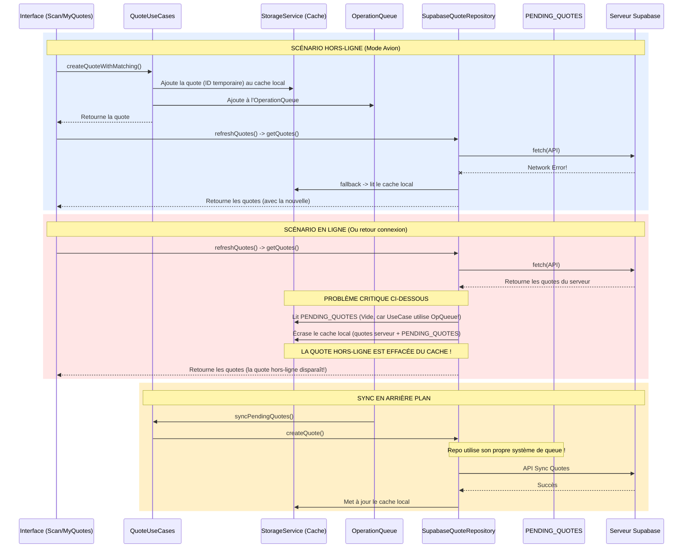

# Ajout d'une citation (En ligne vs Hors-ligne)

L'architecture actuelle a un défaut de conception (un "double système de file d'attente") qui explique pourquoi les citations ne s'affichenent pas toujours ou sont instables hors-ligne. 

Voici le diagramme du comportement actuel :

### Pourquoi cela ne marche pas et est-ce une bonne pratique ?

**Non, ce n'est pas la bonne pratique actuelle.** 

Le problème fondamental est qu'il y a **deux systèmes de synchronisation hors-ligne qui se battent** :
1. `QuoteUseCases.ts` utilise `OperationQueue` (votre nouveau système unifié).
2. `SupabaseQuoteRepository.ts` utilise son propre système historique `STORAGE_KEYS.PENDING_QUOTES`.

Quand vous êtes en mode avion et que vous ajoutez une citation :
1. `QuoteUseCases` l'ajoute bien à `OperationQueue` et au cache local.
2. Si vous rafraîchissez l'écran ou qu'une autre action appelle `getQuotes()`, le repository `SupabaseQuoteRepository` essaie de lire les citations depuis le réseau. S'il réussit (par exemple si la connexion revient une seconde), il écrase le cache local en fusionnant le serveur et `PENDING_QUOTES`. Mais comme votre citation est dans `OperationQueue` (et pas `PENDING_QUOTES`), elle **disparaît visuellement du feed** jusqu'à ce que `OperationQueue` réussisse à la synchroniser en arrière-plan plus tard !

De plus, l'interface attend parfois un format précis, ou un conflit de clés `id` fait que l'optimistic update de React Query n'est pas conservé. 

### La solution (Bonne pratique de l'industrie)

La bonne pratique est d'avoir **une seule source de vérité (Single Source of Truth)**.
1. Nous devons supprimer l'ancien système `PENDING_QUOTES` de `SupabaseQuoteRepository` pour qu'il devienne purement un connecteur API.
2. Toute la logique hors-ligne (`OperationQueue`, fallback sur le cache local) doit être gérée soit dans React Query (`persistQueryClient`), soit centralisée dans le `UseCase`.
3. Assurer que `getQuotes` récupère les éléments de l'`OperationQueue` pour les afficher tant qu'ils ne sont pas synchronisés.
